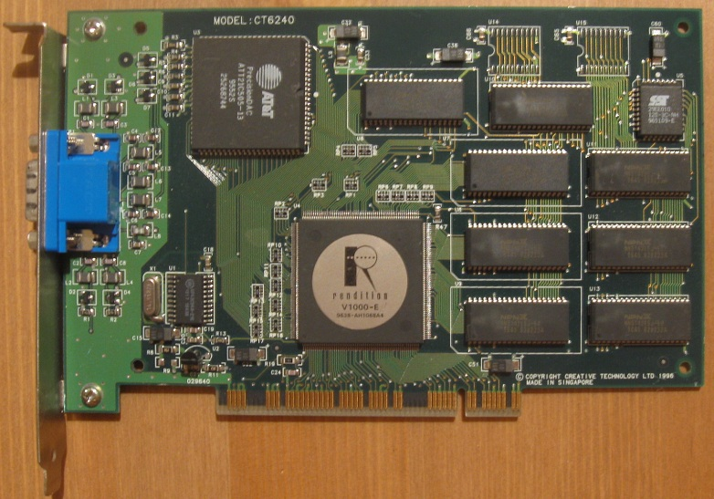
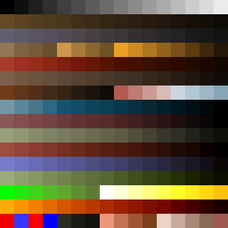
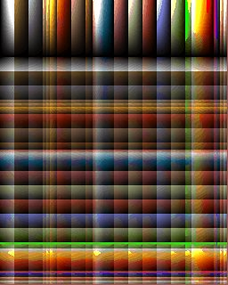

# Quake II
---
本项目改编自[Yamagi Quake2](https://github.com/yquake2/yquake2), [Github链接](https://github.com/yslib/myquake2.git)。

关于Quake2 的代码资料来源于[Quake2 Source Code Review](https://fabiensanglard.net/quake2/index.php)

## Quake I:

- Original Quake: Dos

- VQuake: for Rendition Vérité V1000



- GLQuake: OpenGL

- WinQuake: Windows

Quake I 的工程构建方式比较古老，改造成现代工程比较困难。所以选择了Quake II

## Yamagi Quake2和原版的区别

由于官方原版代码工程基于VC6.0，现在能完全无阻碍运行VC6.0的环境也不太好折腾了，
另外跨平台方面可能做的有些问题，并且有部分的汇编代码，对阅读代码不利。

Yamagi Quake2 用CMake组织工程，并且进行了跨平台化，一键无阻碍编译，并且去掉了汇编代码。增加了
OpenGL3.x和Vulkan的支持，可以无阻碍地运行在现代硬件之上。

- 修改了部分数据结构和 API的名字，比如原版用Refresh来表示渲染器，可能当初Renderer的概念还没成型。模块的名字虽然没有改，但是内部API的名字已经改了
比如原版VID_LoadRefresh改成了VID_LoadRenderer。相比于原版，renderer的导出函数增加了。

## 软渲染流程

为了高效，软渲染其做了两个妥协：
1. 只支持白色光源，不支持彩色光源，这就为查表实现纹理着色提供了可能。
2. 没有线性滤波的纹理

降低纹理的颜色位宽，是为了降低CPU读写内存的开销。软渲染器的通病是从内存写入到显存的过程开销大，而且频繁发生内存读写，考虑到那时候的
CPU性能，所以颜色位宽不能太大。

纹理是256色的贴图，通过光照贴图，给每个颜色提供一个6bit的梯度(64级)。就可以很容易并且高效地用查表的方式进行着色。

这个软渲染器是一个为BSP场景 + PVS剔除 和基于调色板的纹理和光照贴图的高度特化实现。



[Image origin from fabiensanglard.net](https://fabiensanglard.net/quake2/quake2_palette.jpg)



[Image origin from fabiensanglard.net](https://fabiensanglard.net/fd_proxy/quake2/COLORMAP.jpg)

### BSP:

### PSV:

### Lightmap:
读入磁盘之后被归一化到[0,64)之间的灰度值。(选择R,G,B中最大的)

### 流程：
  1. 遍历BSP，找到当前viewpoint所在节点。
  2. 遍历BSP，根据之前viewpoint所在的节点查询PSV，标记节点可见性。
  3. 遍历BSP，计算光源对每个节点是否有影响，并标记上影响的光源id。
  5. 遍历BSP，按照从前到后的顺序渲染场景，扫描线光栅化，写入zbuffer，因为之后还是要绘制动态的spirte
  6. 绘制实体，根据zbuffer决定可见性。
  7. 绘制透明纹理。（水）
  8. 绘制粒子。
  9. 后处理，受伤后视野变红。

  Lightmap和纹理通过查表的方式融合。而不是直接blend

```c
  void RE_RenderFrame(refdef_t *fd)
  {
    R_SetupFrame()
    {
      R_ModPointInLeaf(){

        ...
        while (node->contents == -1) // unitl a leaf node
        {
          float d;
          mplane_t *plane;

          plane = node->plane;
          d = DotProduct (p,plane->normal) - plane->dist; // Just a 3D-Plane Equation
          if (d > 0)
            node = node->children[0];
          else
            node = node->children[1];
        }
        ...
      }   
    }

    R_MarkLeaves(){
      ...

      // cluster>>3 -> cluster/8
      // 1<<(cluster&7) -> cluster%8

      if (vis[cluster>>3] & (1<<(cluster&7)))   // Locates the bit position in PVS bit vector
      {
        node = (mnode_t *)leaf;
        do
        {
          if (node->visframe == r_visframecount)
            break;
          node->visframe = r_visframecount;
          node = node->parent;
        } while (node);
      }
      ...
    }

    R_PushDlights()
    {

      ...
        // mark the polygons
        surf = r_worldmodel->surfaces + node->firstsurface;
        for (i=0 ; i<node->numsurfaces ; i++, surf++)
        {
          if (surf->dlightframe != r_dlightframecount)
          {
            surf->dlightbits = 0;
            surf->dlightframe = r_dlightframecount;
          }
          surf->dlightbits |= bit;
        }
      ...

    }

    R_EdgeDrawing()
    {
      R_RenderWorld()
      {
        ...
          R_RecursiveWorldNode()
          {
              // clip if need

              R_RecursiveWorldNode (front or back)

              ...
              R_RenderFace()
              {
                //Push the surface into stack
              }
              ...

              R_RecursiveWorldNode (back or front)
          }
        ...
      }

      R_DrawBEnittiesOnLists(); //

      R_ScanEdge();
    }

    R_DrawEntitiesOnList(); // Character animation, etc

    R_DrawParticles();

    R_CalcPalette(); // Post-effect by changed the palette
  }
```
## OpenGL渲染流程


相比于Software Renderer，这个就简单了许多。

```c
R_RenderView(){

	SetupFrame();

	SetFrustum();

	SetupGL();

	GL3_MarkLeaves();

	GL3_DrawWorld(){

  }

	GL3_DrawEntitiesOnList();

	GL3_DrawParticles();

	GL3_DrawAlphaSurfaces();

}

```

## C/S架构
