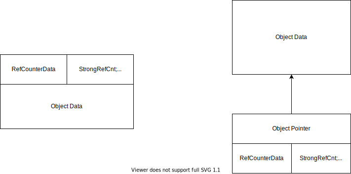
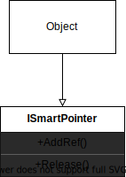
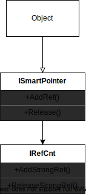

# 侵入式智能指针

我们这里不讨论```std::shared_ptr<T>```，c++标准库里的这个指针在大多数场景下可以满足需求，然而这种非侵入式的智能指针有个最大的弱点，即只能局限在C++当中。
如果想要在更通用的动态库中使用，这种指针无能为力。因为不能把一个C++对象传到其他语言中。只能通过C接口的方式来使用指针。

侵入式的智能指针可以解决这个问题，原因在于引用计数模块不再是和所管理的对象整体抽象为一个诸如```std::shared_ptr```这个只能在C++工程之内传来传去的对象。而是直接把引用计数模块当作对象的一部分，通常，作为基类，也就是需要使用这个智能指针的对象需要继承自一个引用计数模块，这个模块提供```AddRef```和 ```Relese```这两个接口。这样，我们可以在使用普通指针的同时手动控制引用计数。当然这样看起来不太C++，并且有出错的可能，但是缓解这个问题的办法就是做一个```Ref<T>```的guarder warpper。创建时调用```AddRef```,析构时调用```Relese```。此外，这种指针还有一个理论上的有点，因为当作函参数传递时可以用普通指针，所以在多级频繁传递的时候开销要比```std::shared_ptr```小一些（但是这个编译器很可能会优化掉，以至于```std::shared_ptr<T>```）。



总的来看，这两种智能指针几乎可以说是完全不冲突，各自有各自的应用场景。是相互补充而不是水火不容的关系。


但是侵入式的智能指针使用起来不是很方便，而且涉及到的东西比较多，不如非侵入式的直观。而且比较笨重(比如不太能对一个内置类型比如int使用这种指针)适合做一些基础框架性质的工作，因此是实现插件插件不可缺少的一个部分，因为插件需要维护引用计数，方便随时加载和卸载。

接下来介绍一种实现方式，这种实现方式利用C++ 的CRTP特性，可以尽量使整个智能指针的架构做到模块化，比如引用计数的部分可以定制。


首先规定每一个使用这个指针的类都必须继承自一个接口```ISmartPointer```, 
```cpp
class MyObject: public ISmartPointer{};
```



如果我们要实现引用计数部分可以自己定制，那就需要把引用计数抽象出来，给引用计数设计一个接口```IRefCnt```，变成如下结构, 

```cpp
class MyObject: public ISmartPointer{};

class ISmartPointer:public IRefCnt{};
```



然后对IRefCnt做实现，
```cpp

```

