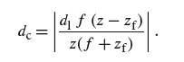
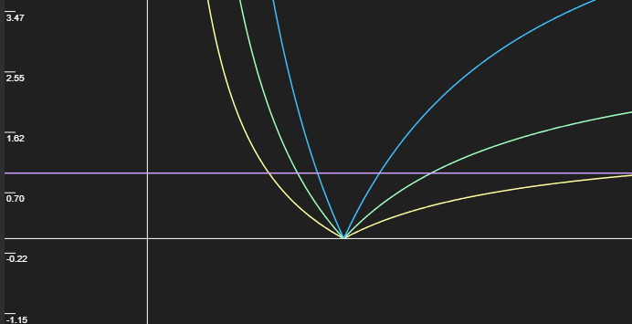

# 视图矩阵
在描述相机的时候，我们需要三个参数，即相机在世界坐标中的位置以及右方向和上方向。可以通过叉积确定前方向。这三个方向就是相机坐标系在世界坐标系中的基。所以很容易写出相机坐标系到世界坐标系的变换矩阵。这个矩阵的逆就是视图矩阵。

# 相机变换在光栅化和光线追踪当中的不同
在光栅化中，我们通常使用MVP矩阵把顶点变换到裁剪空间，然后送给片段着色器进行着色。这时候我们最终要操作的步骤回到了片段上。然而对于光线追送，
我们的出发点是屏幕上的采样点，然后根据给定的摄像机（观察矩阵）需要生成一个这个采样点对应的光线，最终是得到一个在世界空间当中的射线。可以发现，
这两个过程是相反的。所以在观察变换这一块需要相反的变换。

对于一般光栅化的过程比较简单，只需经过MVP这种常规的变换就可以了。因为接触的比较多，所以很熟悉。

对于光线追踪，我们需要给定屏幕上的一个点，生成一条在世界坐标系中的射线。首先需要把屏幕上的点变换到观察空间，然后用这个点和相机原点得到在相机空间中的射线，
最后通过V矩阵的逆矩阵变换到世界坐标系中。把屏幕上的点变换到观察空间首先需要变换到屏幕--(缩放)--> NDC--(透视除法)-->裁剪空间--(P的逆矩阵)-->观察空间。与光纤追踪不同的是，使用光栅化时，硬件
帮我们完成了裁剪空间到屏幕空间的转换。在这里，我们需要把屏幕空间变换到裁剪空间中，这一步比较直白。因为我们假设屏幕就是裁剪空间中的前平面，z值为0。然后直接变换到相机空间。

# 真实感相机
在图形学中所使用的MVP矩阵定量的描述了物体到投影平面的空间变换关系。从真实感绘制的角度来讲，还需要从光学的角度去模拟相机拍摄的成像过程。一般在真实感绘制中，我们需要在几何光学的层次上去模拟光线的传输，其中就包括光线在镜头中的传播以及成像的过程。
下面就简单的介绍一些光学模型。

最简单的就是**小孔成像**，这是一种最理想化的成像模型，只有一条光线能经过小孔。这种成像系统没有焦距，也就是可以在小孔后的任意距离上呈现清晰的像，考虑到光线的衰减，只会有明暗的不同。

然后就是**透镜成像**。这里又可以分为两种，第一种是单透镜，可以实现虚化(景深)效果。这里涉及到一些概念，包括光圈(aperture)，景深(depth of filed)，弥散圈(circle of confusion)。
景深的程度其实由弥散圈，传感器性质以及人眼的分辨率共同决定的。

给定一个成像平面位于zf'（不一定在焦点处），有其所对应的一个能够对焦在这个成像平面上的物体的距离zf。对焦的过程就是调节zf'的过程，当把成像平面调整到焦点的位置上时，就对焦在了无限远处，实际上就是能看清很远的地方。在zf的前后范围内，有一个能够成人眼能够分辨的清晰度的像的范围。这个范围就是景深（Depth of Field）在这个范围的前后的边界的位置上所成的像不能在成像平面上会聚成一点，而是一个有一定直径的光斑。这个圆圈就是弥散圈。(只需要简单的几何推导,弥散圈dc = func(z) = abs(d1*f*(z-zf)/(z(f+zf))，d1为光圈大小)如果我们把这个弥散圈当作一个衡量成像分辨率的指标，即当这个光斑大到一定程度，使得相机的传感器和人眼都不能识别出清晰的图像。那么给定一个弥散圈，就能确定在某位置物体的景深范围。这样的话，我们会有两个相同的解释方式：其他条件相同的情况下，相机的弥散圈越大（无论以怎样的方式实现，比如更高分辨率的成像传感器，或者是其他什么黑科技）景深越大，则成像清晰的范围就越大，越不容易产生模糊效果。与此等价的说法是：其他条件相同的情况下，景深越小，弥散圈越小。
公式dc= func(z) 的曲线形状类似于|log(x)|，func(z) = 0 的零点是 z = zf。给定一个相机的dc，在这个曲线上画一条横线，对应的两个z1,z2就是对焦在zf处物体的景深范围，可见前景深与后景深的变化不是对称的。d1对于这条曲线的影响就是在其他条件相同的情况下如果d1越大，那么这个曲线越收紧，对应的景深就越小，越容易产生虚化效果。

单个凸透镜头的成像系统可以摄影当中基本的概念。然而实际的单反相机的镜头是由多个透镜组成的。原因之一是可以实现变焦，同时多个透镜可以修正一个透镜引入的像差（这又是另外一个复杂的光学话题了），达到更好的成像效果。
在真实感绘制中引入了多这种多透镜的相机模拟，这样我们需要为每个透镜建模，为了简单我们假设每个透镜都是球面镜，这样我们只需要一个半径参数就能描述透镜的几何特征。实际的相机镜头中为了获得更好的成像效果，都会加入非球面透镜，这已经是比较现代的技术了。因为在理论上，球面透镜不能把光汇聚在一点，产生了球差。在真实感绘制中，我们只模拟球面镜。
一个透镜由四个参数决定：
**曲率半径** **厚度** **折射系数** **直径**
厚度是到下一个镜片的距离。

# 模拟景深
模拟景深需要两个额外的参数，即**光圈（Aperture）**和**焦距(focus distance)**，还有一个对焦距离，对焦距离就是能够清晰的成像的物体的距离。
  。景深所产生的模糊效果粗浅的解释为焦平面前后的物体在像平面上不能聚为一个点而是一个光斑。
这里需要在光圈范围内进行圆盘均匀采样，然后以这个采样点到对焦距离的点（这个点是原始像素与透镜中心的连线与对焦平面的交点）的方向代替这个采样点的方向。
进行多次采样最后取平均。

所以，最后景深的效果和光圈,也就是采样范围有关。但是从之前的公式看还应该与焦距有关。这个焦距已经暗含在了P矩阵的fov里了。因为焦距越大，镜头里像平面的距离越远，这也会对景深产生影响。
具体体现在相对采样面积减小。

