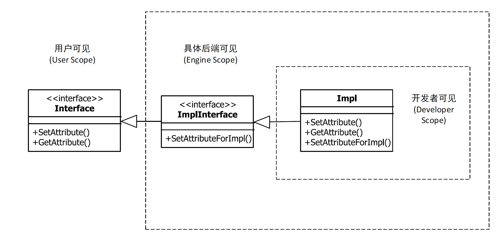
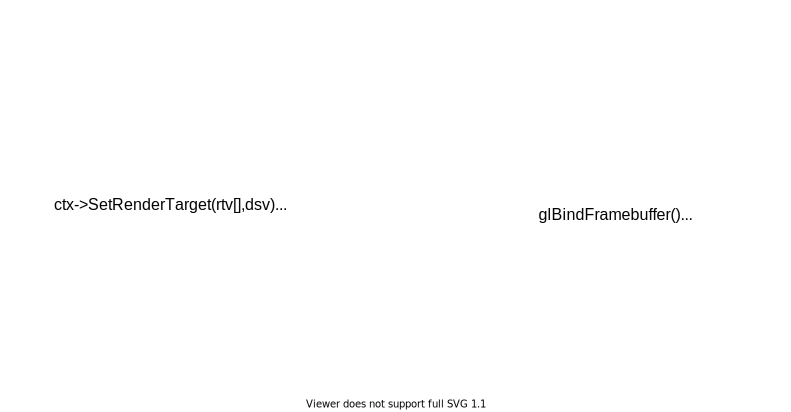
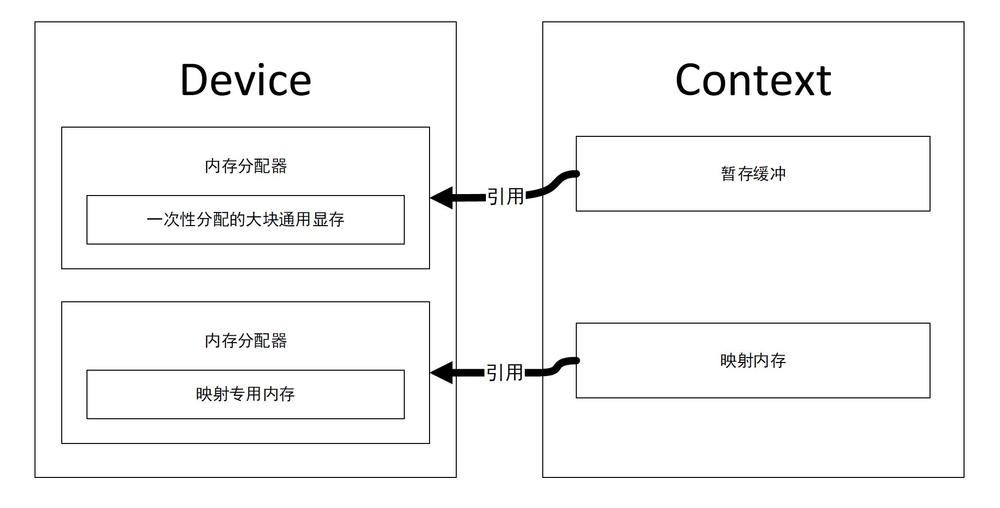
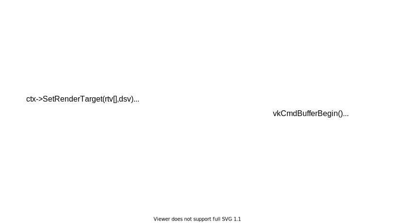
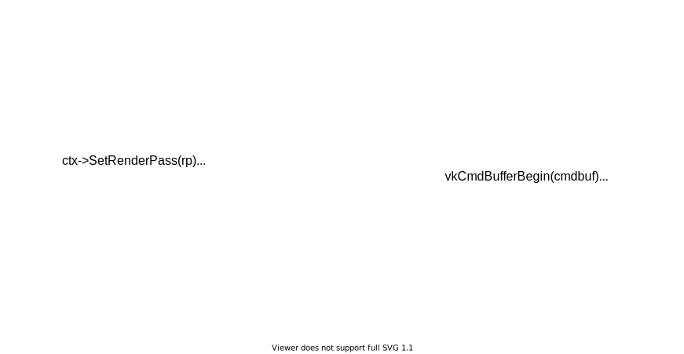

# DiligentEngine

https://www.gamasutra.com/blogs/EgorYusov/20171130/310274/Designing_a_Modern_CrossPlatform_LowLevel_Graphics_Library.php

这个跨平台图形API是我在google上搜索如何设计RHI时候偶然发现的，个人认为其代码结构和设计比[BGFX](https://github.com/bkaradzic/bgfx)这个又名的开源底层渲染接口要好。
其实现了不同的平台下的API封装，整体接口风格是按照DX11来的，因此，能够非常好的与Vulkan和DX12这种现代API适配。当然这个套API比较新，应用没有BGFX多。

- 轻量级，低开销

这个轻量不是指代码少，而是它只关注封装不同的Graphics API而不过多考虑除此之外的任何其他任务。相比于其他项目，这个项目的代码并不少，而且其代码的质量也是这个项目的亮点。

- 方便使用

方便使用有时候和低开销是相互矛盾的，因为方便使用意味着要抽象更多的东西。虽然API的风格保持了和D3d11同样的底层，
但在API能够反应硬件流水线的工作流程的同时，也不至于像直接操作具体的图形API那样繁琐。在简介和方便之间平衡性做的比较好。

- 并行

在兼顾OpenGL等旧API的同时，也能够充分利用D3D12和Vulkan的并行特性。

- 扩展性

良好的分层设计可以针对不同的后端做不同的优化。可以方便使用每个后端特有的功能，或者是为具体的后端编写合适的代码。
这个项目提供了一个替换Unity Graphics API的插件实例。


|Project|Line of Code|
|:----:|:----:|
|DiligentCore|94000+|
|bgfx|70000+|
|LLGL|77000+|

## 总揽

### RenderDevice

Creates other objects (resources resources view, pipeline state, shader, shader resources binding etc.)

### DeviceContext

- ImmediateContext
记录所有绘制指令

- DeferredContext

### Swapchain
管理一系列帧缓冲，最后负责呈现到屏幕上


>上面三个对象是在创建框架的时候初始化的

### Resources

主要是Texture 和Buffer

### Resources View
Texture 和 Buffer 的具体解释

### PipelineState

### Shader Resources Binding
用来管理Shader uniform 资源绑定的抽象类。这个框架在Shader的使用上做了一些小抽象，让Shader可以使用文件系统，如在shader当中使用#include。这个工作是通过
ShaderSourceStreamFactory的一个工厂对象实现的。

> 这个框架直接支持GLSL, HLSL。然后转换到不同的后端。一般使用HLSL，因为GLSL不能转换到HLSL。


## 接口组织形式




整个框架以面向接口（抽象基类，纯虚函数）的方式来组织，类似于COM技术。对于不同层次的API（不同渲染后端），类型提升为不同类型的接口实现，
拿其中某个对象来举例，对于通用的**Buffer**类型，以接口**IBuffer**使用。
对OpenGL后端实现一个**IBufferGL**接口类，对Vulkan实现一个**IBufferVk**接口类，来实现对不同API功能进行接口特化。


```cpp

class IObject{
    virtual void QueryInterface(const IID & iid, void ** ppBuffer)=0;
    virtual void AddRef()=0
    virtual void Release()=0;
};

class IBuffer:IObject{

    //
    virtual void SetData(const void * data,size_t size) = 0;
};


class IBufferGL:IBuffer{
    virtual uint32_t GetNativeGLBufferHandle()=0;
};

class IBufferVk:IBuffer{
    virtual VkBuffer GetNativeVkBufferHandle()=0;
};

```

然后使用CRTP的方式对不同后端的接口进行不同的实现

```cpp

template<typenmae Interface>
class BufferBase:public Interface{
    // Maybe there are multi inheriante levels between BufferBase and Interface
};

class BufferVkImpl:public BufferBase<IBufferVk>{
    VkBuffer GetNativeVkBufferHandle()override{return m_vkBuffer;}
};

class BufferGLImpl:public BufferBase<IBufferGL>{
    VkBuffer GetNativeGLBufferHandle()override{return m_handle;}
};

```

### 导出 C-style 接口

DligentEngine早期版本只有C++的接口，所以其代码在早期版本写的相对直白，之后加入了C接口之后，为了以最小代价同时实现两种接口，接口的声明完全用宏进行了封装，这样显得接口的变得不那么直白。

为了统一实现，预定义了一些宏
```cpp

#if DILIGENT_C_INTERFACE

#    define THIS  struct DILIGENT_INTERFACE_NAME*
#    define THIS_ struct DILIGENT_INTERFACE_NAME*,
#    define VIRTUAL
#    define CONST
#    define PURE
#    define REF          *
#    define METHOD(Name) (DILIGENT_CALL_TYPE * Name)

// clang-format off
#    define DILIGENT_END_INTERFACE\
        typedef struct DILIGENT_CONCATENATE(DILIGENT_INTERFACE_NAME, Methods) DILIGENT_CONCATENATE(DILIGENT_INTERFACE_NAME, Methods); \
        typedef struct DILIGENT_CONCATENATE(DILIGENT_INTERFACE_NAME, Vtbl)  \
        {                                                                   \
            DILIGENT_CONCATENATE(DILIGENT_INTERFACE_NAME, InclusiveMethods);\
        } DILIGENT_CONCATENATE(DILIGENT_INTERFACE_NAME, Vtbl);
// clang-format on

#else

#    define THIS
#    define THIS_
#    define VIRTUAL      virtual
#    define CONST        const
#    define PURE         = 0
#    define REF          &
#    define METHOD(Name) DILIGENT_CALL_TYPE Name
#    define DILIGENT_END_INTERFACE

#endif

```

通过这些宏来统一定义一个接口，比如对于```ITextureVk```这个接口的声明
```cpp
#define IBufferVkInclusiveMethods \
    IBufferInclusiveMethods;      \
    IBufferVkMethods BufferVk

DILIGENT_BEGIN_INTERFACE(IBufferVk, IBuffer)
{
    VIRTUAL VkBuffer METHOD(GetVkBuffer)(THIS) CONST PURE;
    VIRTUAL void METHOD(SetAccessFlags)(THIS_
                                        VkAccessFlags AccessFlags) PURE;
    VIRTUAL VkAccessFlags METHOD(GetAccessFlags)(THIS) CONST PURE;
    VIRTUAL VkDeviceAddress METHOD(GetVkDeviceAddress)(THIS) CONST PURE;
};
DILIGENT_END_INTERFACE

#if DILIGENT_C_INTERFACE

#    define IBufferVk_GetVkBuffer(This)         CALL_IFACE_METHOD(BufferVk, GetVkBuffer, This)
#    define IBufferVk_SetAccessFlags(This, ...) CALL_IFACE_METHOD(BufferVk, SetAccessFlags, This, __VA_ARGS__)
#    define IBufferVk_GetAccessFlags(This)      CALL_IFACE_METHOD(BufferVk, GetAccessFlags, This)
#    define IBufferVk_GetVkDeviceAddress(This)  CALL_IFACE_METHOD(BufferVk, GetVkDeviceAddress, This)

#endif
```
对于C++接口来说，生成
```cpp


class IBufferVk:IBuffer{
    virtual VkBuffer GetNativeVkBufferHandle()=0;
};

```
对于 C来说，生成了一个虚表结构体
```cpp
typedef struct IBufferVk{
    struct IBufferVkVtbl * pVtbl;
}IBufferVk
struct IBufferVkMethods
{
    VkBuffer (* GetVkBuffer)();
    void (* SetAccessFlags)(IBufferVk *this,VkAccessFlags AccessFlags);
    //...
};

typedef struct IBufferVkMethods IBufferVkMethods;
typedef struct IBufferVkVtbl
{
    IBufferVkInclusiveMethods;
} IBufferVkVtbl;

```

C接口的使用方法为
```cpp

pBuffer;

IBufferVk_GetVkBuffer(pBuffer,args...)
```

对应
```cpp
pBuffer->pVtbl->BufferVk.GetVkBuffer((IBufferVk*)(pBuffer),args...)
```

其原理是通过声明一个和C++ interface内存布局一样的一个C-style 的struct(一个带有函数指针的接口体当作虚表)，来给出对外使用接口的形式。
通过CRTP的方式和框架本身的一个**侵入式的引用**计数框架，在内存块上构造对象上（```malloc``` 以及 ```placement new```），最终实现还是C++代码。
**这种方式利用了C++事实上的多态实现的内存布局，实现了使用C++的全部特性来写C语言库的目的**

## 框架组成

以D3D11的方式封装的，可以照顾到Vulkan和D3D12这种现代API。

这个框架使用方式如下:

```cpp

void Init(){

auto buffer = pDevice->CreateBuffer(vertexData);
auto image = pDevice->CreateTexture(texData);

// configure pipeline
// ...
auto pipelineState = pDevice->CreatePipelineState(pipelineDesc);


pContext->DrawIndexed(0);

}

void Update(){

}
```

## Internels

如何封装这种API? 首先需要明确两个问题，1）我们希望打算如何使用这个API 2)渲染一帧的主流程是什么样子的

先回答第二个问题，第二个问题非常简单：

```cpp
while(true){
    if(Initialized == false){
        Init();
        Initialized = true;
    }
    Update(){
        // Update per frame data
    }

    Render(){
        // Drawcalls
    }

    Submit(){
        // Submit drawcalls
    }
}
```

所以我们的目的就是在```Init()```中初始化数据，在 ```Update()```里更新每帧的数据，在```Render()```中提交绘制指令。

对于DiligentEngine，一般的渲染流程为

```cpp
Init(){
    vertexBuffer = device->CreateBuffer(vertexData);
    indexBuffer = device->CreateBuffer(indexData);
    uniformBuffer = deice->CreateBuffer(uniformData);
    pipelineState = device->CreatePipeline(pipelineDesc);
    shaderResourcesBinding = pipeline->CreateShaderResourcesBinding(uniformDesc);
}

Update(){
    uniformBuffer->SetData(uniformData);
}

Render(){
    context->SetIndexBuffer(indexBuffer);
    context->SetVertexBufffer(vertexBuffer);
    context->SetPipelineState(pipelineState);
}

```


|Backend|Line of Code|
|:----:|:----:|
|OpenGL|15300+|
|Vulkan|19600+|
|D3D11|8600+|
|D3D12|15500+|

### OpenGL Backend

先把OpenGL的做一层封装ContextState，

由于OpenGL的Contexnt是全局隐式的，所以Device和 Context的实现就比较简单了，基本上Device的实现只是记录信息字段或者glGetIntegerv glGetString这种查询api，Context对应的函数如果有直接的OpenGL实现就直接调用。在OpenGL中没有显式的PipelineState这个对象，所以在这里的实现就只是记录下来设置的管线状态。





### Vulkan Backend

对于Vulkan来说，重点关注**手动同步**，**布局转换**以及**内存管理**。因为这些东西正是一个方便使用的接口所掩盖的。

#### Memory



#### RenderPass





显式指定的RenderPass这些信息可以允许驱动对绘制操作进行重排序，把每个Pass按照Tile绘制，把每个绘制完成再写入显存，避免了存储立即绘制时每个Pass产生的数据然后下个Pass需要时进行会读的操作。
这种优化主要是针对于没有专用显存的统一内存架构的移动设备。即使桌面GPU也会从中受益。

#### 必要的优化
作为一个底层RHI，
因为RenderPass只是一种描述，满足一定条件可以复用（通常是Attachment 数量和格式相同时），所以在基于RenderTarget使用时，其框架创建的RenderPass都是被放在Map中进行缓存的，能够唯一确定一个RenderPass的一些条件被用作Key，在调用指定RenderTarget的API时，SetRenderTarget时会先从缓存中去找是否有满足条件的RenderPass，如果存在就使用已有的，不存在就创建新的，然后缓存。对于Framebuffer也是同样的处理方式。

