# 体素(Voxel)

最近自己在自娱自乐的写一个体素[存储引擎](https://github.com/yslib/VoxelMan.git)， 在这里记录一下需要用到的相关资料。

自己写的这个体素存储引擎主要面向大规模(100TB)科学计算可视化数据的（以Raycasting 渲染为主），这种应用的特点是数据是**稠密**的，并且**不能引入太多预处理过程**，因为数据量太大，预处理的开销也是不可接受的。而且这种应用一般都需要实时改变传输函数，相当于整个空间都有数据。当然也不绝对，因为即使对于大部分科学计算数据来讲，至少表现上是稀疏的，我们感兴趣的部分基本上不太可能充满整个空间，总有一个主体。但是为了不失一般性，加入了可实时改变传输函数这个约束，整个数据就谈不上稀疏性了，或者说稀疏性变得不是那么直白。但是可以借助平衡树来作为mask管理可见块。(Hierachical DDA)。

## 目录

- [Raycasting](#raycasting)

- [体素存储](#storage)

  - [GPU: Sparse Volume Octree](#storage_gpu)
  - [CPU: OpenVDB](#storage_cpu)
  - [Dense Voxel Layout Optimization](#storage_layout)

- [体素应用](#application)
  - [有向距离场](#app_sdf)
    - [Lumen](#app_sdf_lumen)
  - [虚拟纹理](#app_vt)


- [其他](#others)
  - [体素渲染](#others_rendering)
  - [有关项目](#others_project)

- [参考文献](#references)


<span id="raycasting"></span>

## **Volume Rendering & Ray-Casting Ray-marching)**

虽然这里主要介绍体素的存储，并且体素的表现方式并不局限于Raycasting，但是对于体素来说，Raycasting终归是一个绕不开的话题。在这里简单的介绍一下Raycasting.

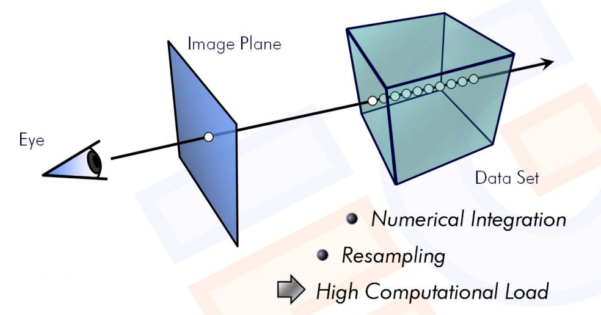

对从当前像素发出的射线上每个点进行颜色累加作为这个像素最终的颜色，

- 从前先后：

$$
C_{dst} = C_{dst} + (1 - \Alpha_{dst}) C_{src}
$$

$$
\alpha_{dst} = \alpha_{dst} + (1 - \Alpha_{dst}) C_{src}
$$

- 从后向前：

至于这个公式是怎么来的，可以参考[Real-Time Volume Graphics][2]这本书。总的来说，上面的两个形式就是在只考虑吸收和发散模型的光线在介质中的传播方程，经过离散化（积分->黎曼和）后的[数值解法](https://www.cg.informatik.uni-siegen.de/data/Tutorials/EG2006/RTVG01_Theory.pdf)。

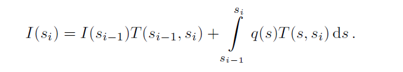

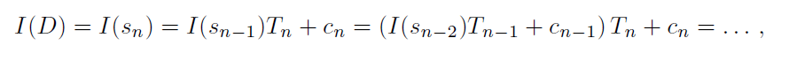


<span id="storage"></span>

## 体素存储：


### **相关文章**


<span id="storage_gpu"></span>

### SVO(GPU)

八叉树存储，重点是八叉树的遍历方式。这种类型的数据结构一般都是stackless遍历。
比如对于[kd-tree的有栈遍历方法][11](无递归):

1. 判断射线和当前的节点的相交片段，如果只包含了分割平面的其中一侧（一定是里视点近的那一个），那就直接遍历这个节点。否则先把远处的那个节点压栈，然后遍历这个（离视点近的）节点。
这样栈顶部的节点距视点的距离比栈底部的节点更近。
2. 这样一直遍历去，如果当前节点是叶节点，执行普通求交规则，如果hit，则执行相应逻辑，否则判断栈是否为空。如果为空，整个遍历过程结束（即遍历完整个场景了），否则出栈继续执行上一步。


[去掉这个栈操作有两个方法][12]

1. 去掉压栈操作，并且在原算法需要出栈的时候，直接从(root, tMax, global_tMax)的地方**重新遍历树**。也就是直接从根节点寻找下个节点（不用栈存储了）(kd-restart)
2. 去掉压栈操作，并且在原算法需要出栈的时候，直接回溯到第一个修改[tMin,tMax]的祖先的节点，然后继续遍历。（这种方法需要额外记录父节点信息）(kd-backtrace)

其实这些方法的核心思想都是基于DDA的，即对于一个射线区间段[tMin, tMax]来说，下一个区间段的tMin就是当前区间段的tMax。虽然标准的DDA是面向规则网格的(Grid)，但是对于这种层次化的树结构，虽然网格不是规则的，但上述事实并没有改变。（只要保证是空间的一个划分）

octree和kd-tree不同的地方在于，octree是局部规则的网格，在遍历子节点的时候可以直接通过坐标转换得到。

### [GigaVoxels(GPU)][6]:

- N^3-Tree


- 树的组织形式不是通常的指针（因为要在纹理里面存储），而是层次化的3d-texture cache。分为两个3d texture。 其中一个存放node metadata。每个node metadata里面有N^3个关于
元素，按照对应的空间位置排列。可以看到，这本质上就是一个以direct accessed array方式存储的被层次化的hash table。指针被解释为block在texture 中的偏移。

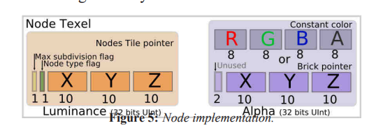

- 表面是个树，其实是一个hash table。

至此，存储部分就结束了，其实存储部分没有多少内容。

接下来就是绘制, Ray-casting的时候是用的是类似于kd-restart去遍历octree。

Feedback过程是关键。这里使用的是多个RT存储缺页id。组织成一个2d texture array。 就像实现OIT一样，每个像素对应一个链表（数组），用来存放这个像素对应的射线在遍历的时候发现的没有在显存中的block id。但是直接这样做有两个问题：


1. 相邻像素发出的射线大概率会检测到相同的块，因此重复度很高。

2. 一个像素对应一个链表可能会使空间分配不均因。

基于以上两点考虑，可以让2x2四个像素公用四个链表的存储空间。

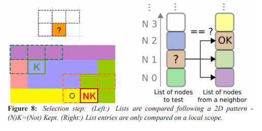
CPU直接处理这几个RT里面的信息显然吃不消（除了回读的代价外，还需要无差别遍历这几个rt中的每个像素去找到所有的不重复的缺页id），因此需要一个mask来指示一个不重复的缺页id集合。这个mask也是一张2d texture。每个像素可以解释为一个bit vector(32bit almost)。然后在CPU端通过这个像素信息去索引记录缺页id的rt。当然为这个mask texture 的每个像素构造bit vector除了要去重之外还涉及到了另外一篇文章的方法（金字塔直方图，就是一个统计问题，主要用来压缩），这里不细讲。


总结:
其实这篇文章写作上对读者不太友好。有些地方不够详细。比如feedback的过程和遍历树的过程。因为这两个地方并不是引用的其他文章，这里应该详细描述才对。而且feedback的过程图示非常让人迷惑。


实现了这篇文章的方法的开源项目有 (Voreen)


<span id="storage_cpu"></span>

### [OpenVDB(CPU)][7]


这篇文章描述的数据结构是部署在CPU上的，是梦工厂的开源项目。主要是面向动画变形，仿真等用途的。比起之前的GPU上主要用来面向渲染或者查询数据结构，最大的不同是提供了对体素的操作（增删查改）。
第一次看到这个名字的时候以为是体素数据库的意思，其实VDB并不是体素数据库。虽然这篇文章就是在构造一个体素数据库。

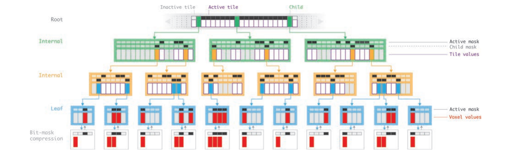


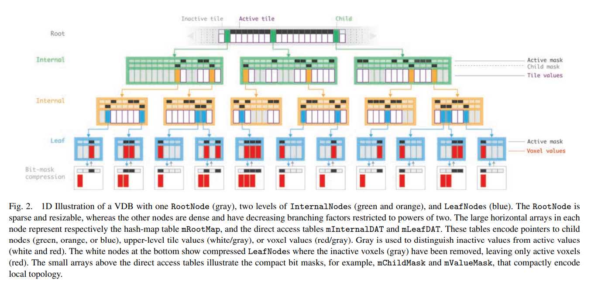


- 一个矮胖的树
    - 树高固定
    - 每个节点分支数固定


- 子节点数量很多。在实现上把节点分为三类做特化**LeafNode**, **InternalNode**, **RootNode**, 用模板参数直接确定节点的结构。

#### 随机访问模式

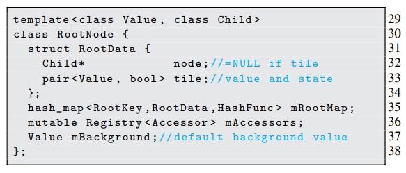

- 全局坐标的block,对于每个体素所在block的坐标的每一维度，取所在block的高位，作为这个block的key。

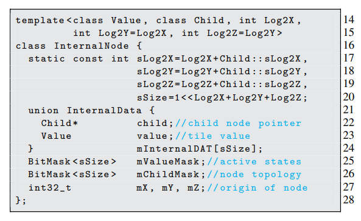

- 全局坐标的(x,y,z)的块内偏移转换成子块坐标: 然后把三维坐标转换为一维坐标。

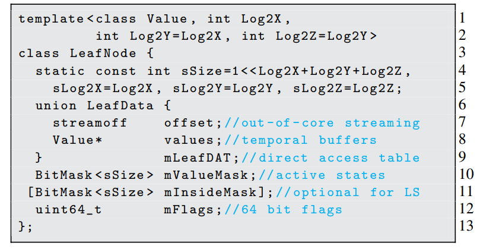

- 体素的块内偏移

注意，除了root用的是hash map，其他的每层(InternalNode和LeafNode)对于子节点的查询都是用了Direct Access Table。

代码当中预定义的一些树

```cpp

using BoolTree     = tree::Tree4<bool,        5, 4, 3>::Type;
using DoubleTree   = tree::Tree4<double,      5, 4, 3>::Type;
using FloatTree    = tree::Tree4<float,       5, 4, 3>::Type;
using Int32Tree    = tree::Tree4<int32_t,     5, 4, 3>::Type;
using Int64Tree    = tree::Tree4<int64_t,     5, 4, 3>::Type;
using MaskTree     = tree::Tree4<ValueMask,   5, 4, 3>::Type;
using StringTree   = tree::Tree4<std::string, 5, 4, 3>::Type;
using UInt32Tree   = tree::Tree4<uint32_t,    5, 4, 3>::Type;
using Vec2DTree    = tree::Tree4<Vec2d,       5, 4, 3>::Type;
using Vec2ITree    = tree::Tree4<Vec2i,       5, 4, 3>::Type;
using Vec2STree    = tree::Tree4<Vec2s,       5, 4, 3>::Type;
using Vec3DTree    = tree::Tree4<Vec3d,       5, 4, 3>::Type;
using Vec3ITree    = tree::Tree4<Vec3i,       5, 4, 3>::Type;
using Vec3STree    = tree::Tree4<Vec3f,       5, 4, 3>::Type;
using ScalarTree   = FloatTree;
using TopologyTree = MaskTree;
using Vec3dTree    = Vec3DTree;
using Vec3fTree    = Vec3STree;
using VectorTree   = Vec3fTree;
```

如果按叶节点的边长是2*2*2来算的话，每个体素一个字节，这些树的整个数据寻址空间为2^(14*3)字节，也就是4TB。

而且由于坐标的编码每个维度是20bit，理论寻址大小为2^(60)字节，1048576TB。

```cpp

/// @brief Tree3<T, N1, N2>::Type is the type of a three-level tree
/// (Root, Internal, Leaf) with value type T and
/// internal and leaf node log dimensions N1 and N2, respectively.
/// @note This is NOT the standard tree configuration (Tree4 is).
template<typename T, Index N1=4, Index N2=3>
struct Tree3 {
    using Type = Tree<RootNode<InternalNode<LeafNode<T, N2>, N1>>>;
};


/// @brief Tree4<T, N1, N2, N3>::Type is the type of a four-level tree
/// (Root, Internal, Internal, Leaf) with value type T and
/// internal and leaf node log dimensions N1, N2 and N3, respectively.
/// @note This is the standard tree configuration.
template<typename T, Index N1=5, Index N2=4, Index N3=3>
struct Tree4 {
    using Type = Tree<RootNode<InternalNode<InternalNode<LeafNode<T, N3>, N2>, N1>>>;
};

/// @brief Tree5<T, N1, N2, N3, N4>::Type is the type of a five-level tree
/// (Root, Internal, Internal, Internal, Leaf) with value type T and
/// internal and leaf node log dimensions N1, N2, N3 and N4, respectively.
/// @note This is NOT the standard tree configuration (Tree4 is).
template<typename T, Index N1=6, Index N2=5, Index N3=4, Index N4=3>
struct Tree5 {
    using Type =
        Tree<RootNode<InternalNode<InternalNode<InternalNode<LeafNode<T, N4>, N3>, N2>, N1>>>;
};

```

#### 具有空间局部性的访问模式

随机访问的上限就是上一小节所描述的。但是如果考虑到空间局部性，可以为频繁访问周围元素的这种访问模式进行加速优化。
其设计思想就是，如果访问模式是频繁访问周围的体素，直接生成一个Accessor，然后用Accessor访问：

比如对于一个访问序列，(0,0,0), (0,0,1) (0,0,2) (5,5,5)
```cpp
acc = tree.getAccess()

acc.getValue(0,0,0) // 慢于普通的tree.getValue(0,0,0), 重新缓存
acc.getValue(0,0,1) // 快于普通的tree.getValue(0,0,1), (0,0,0) (0,0,1)位于同一个叶节点，直接从accessor链表里取
acc.getValue(0,0,2) // 快于普通的tree.getValue(0,0,2)  和上一个节点位于同一个叶节点，直接从accessor链表里取
acc.getValue(5,5,5) // 慢于普通的tree.getValue(5,5,5)  快慢取决于路径的重合程度来重新缓存

```

accessor是一个高度固定的链表，长度为树高，每调用一次getValue或者任意其他访问函数，这个链表就被更新为在这课树上的访问路径，且链表方向和在树上的访问路径相反。

原理就是利用accessor所缓存的上一次查找(x',y',z')的路径找到当前访问(x,y,z)的路径与上一次访问(x',y',z')的访问路径的最近公共祖先。然后从这个节点再向下查找。
最好情况(x,y,z)与(x',y',z')的公共祖先就是同一个叶节点，省去了遍历树的过程，做到了**真O(1)**。最坏情况只有根节点是公共祖先，那就退化为普通的```tree.getValue(x,y,z)```

#### 顺序遍历模式

如果事先确定对网格的局部进行顺序遍历，在实现相应的接口的时候，可以按照存储在内存当中的顺序进行寻址。比如对于某些fill操作，不要简单的使用```tree.setValue(x,y,z)```甚至```acc.setValue(x,y,z)```。因为这两个都没有考虑任何空间局部性。

顺序遍历模式的实现和数据结构高度相关，原则就是快速的进行顺序索引。这里面涉及到很多trick，比如快速判断节点当中的mask的1 bit在第几位(Debruijn序列，专用指令集优化等)。这里就不详细展开了。

#### 模板访问模式
这个是针对具有特定访问模式的一系列优化。比如对于物理仿真，有限元模拟等。这些都是Accessor以及顺序遍历模式的组合。


<span id="storage_layout"></span>
### **布局**

- [Optimizing Memory Access on GPUs using Morton Order Indexing][8]

- [Soring Spatial Data][9]


<span id="app_sdf"></span>
### **有向距离场**

可以用来加速Ray-marching，来辅助全局光照的实现。

全局光照的开销主要是光线和场景中物体表面求交。对于离线的全局光照，可以使用传统的加速结构，做无偏的光线求交。
除此之外，通过空间换时间的办法，在场景中的每一点上，记录这一点到场景中**最近**物体表面的**距离**。当追踪从场景中某一点$o$向某方向$d$
发出的一条光线，可以通过计算出下一个marching 的位置， $\bar{r_{cur}} = \bar{o} + \bar{d} * SDF(\bar{r_{prev}})$，如果此时$SDF(\bar{r})$ 小于某一设定的
阈值时，可以认为此时与物体表面相交。其中，这个**有向距离场SDF**可以看作一个体素存储。

实时更新并获得稳定的SDF时实现良好的实时全局光照的关键。

<span id="app_sdf_lumen"></span>

### **全局光照**

- [RSM][1]


- [VXGI][8]

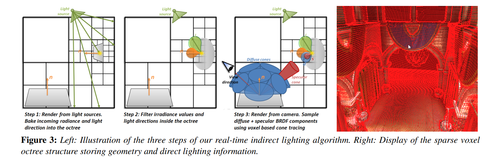

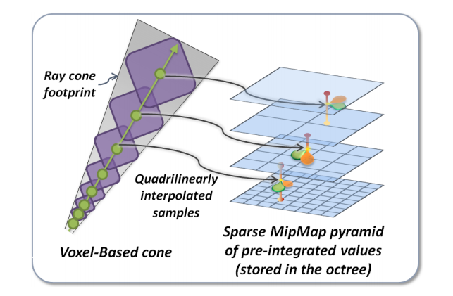

[VXGI][8]相比于[RSM][1]，通过把mesh场景体素化成三维信息(并且动过滤波操作，把高精度的体素信息分别降到了不从层级的lod上，相当于把场景“气化”了，整个体素场景lod相当于**遮挡场**(Occlusion Field))，借助ray-marching累积$\alpha$，根据$\alpha$权重判断这一次的弹射有没有被遮挡。可见这种遮挡的判断也是非常粗糙的，容易漏光。

**并没有对弹射的光线执行任何求交操作来判断严格意义上的遮挡，仅仅是把对遮挡的判断转移到了判断累积光线的不透明度上**

#### **Lumen In UE5**


对场景进行预计算

- UE5使用了复杂化的SDF来加速全局光照计算，并且它时离线计算的。在编辑器中修改了对象之后重新生成。

- UE5 使用软硬结合的ray-tracing，fallback到不同配置的机器上。这里的软件ray-tracing也是用GPU实现的。

    - 对于软件 ray-tracing，使用有向距离场加速，但是同时考虑了物体sdf 和 global sdf来加速。具体来说时对于近处的物体使用精确的local sdf。并且对于mesh和材质有各种限制。

    - 硬件光锥可以使用更高精度的 proxy mesh，然而对于实例数量有限制。


<span id="app_vt"></span>
### **虚拟纹理**

- VT in software
    - Simple in theroy, but hard to implement efficiently.

软件虚拟纹理实现的难点在于，现在的管线似乎不是为频繁更新纹理设计的。因为VT不可避免的频繁（相对）更新纹理，所以这是一个drawback。
虚拟纹理的核心是feekback的过程。这个过程决定了渲染的效率。这个也得是全程软件实现，因此效率千差万别。
优化的办法除了动态的确定working set，还可以离线烘焙feekback data。如同PVS一样，不过这个还和具体应用有关。对于科学可视化来的体绘制来说说，这个几乎不能用，因为不能假定可见性。

现在使用的是ray-guided方式，完全由ray决定。排除实现本身的效率之外，并不清楚这种做法的效率有多高。

就拿PageTable(Address translation)的实现方式来说,hashtable 很直观，但是想要实现一个对GPU管线友好的数据结构还是很困难。

用Texture? 每次都要更新部分纹理。但是其地址转换过程是最快的（直接采样）。但是很浪费空间，基本上虚拟纹理有多大，这个pagetable就有多大（个数上成正比）。

每种方式的实现都千差万别。

- VT in hardware
    不用自己管理映射结构（页表），但是需要自己做缺页处理。一般是在shader里用一个纹理采样，如果采到了就返回纹理数据，采不到就返回一个0之类的。feedback的过程自己处理。


<span id="others"></span>

## **其他**

<span id="others_rendering"></span>

### **体素渲染**

- #### Ray casting

- #### [Ray tracing(contour set, cube)](https://medium.com/@calebleak/cube-voxel-rendering-bc5d87c24c3)

- #### [Cube Rendering](https://medium.com/@calebleak/quads-all-the-way-down-simple-voxel-rendering-fea1e4488e26)


<span id="others_project"></span>
### 有关项目:

- [MagicaVoxel](http://ephtracy.github.io/)

- [Goxel](https://github.com/guillaumechereau/goxel)

- [OpenVDB](https://github.com/AcademySoftwareFoundation/openvdb)

- [Volume of Fun](http://www.volumesoffun.com/)

    - [PolyVox](http://www.volumesoffun.com/polyvox-about/)

    - [Cubiquity 2](https://github.com/DavidWilliams81/cubiquity)


<span id="references"></span>
## 参考文献

[Reflection Shadow Map][1]

[Real-Time Volume Graphics][2]

[Efficient Sparse Voxel Octrees(SVO)][3]

[ShaderToy Implementation][4]

[High Resolution Sparse Voxel DAGs][5]

[GigaVoxels: Ray-Guided Streaming for Efficient and Detailed Voxel Rendering][6]

[VDB: High-Resolution Sparse Volumes with Dynamic Topology][7]

[Interactive Indirect Illumination Using Voxel Cone Tracing][8]

[Optimizing-Memory-Access-on-GPUs-using-Morton-Order-Indexing][9]

[Soring-Spatial-Data][10]

[KD Tree Acceleration Structures for a GPU Raytracer][11]

[Stackless KD Tree Traversal for High Performance GPU Ray Tracing][12]

[Interactive Volume Exploration of Petascale Microscopy Data Streams Using a Visualization Driven Virtual Memory Approach](https://a.com)


[1]: [RMS](https://users.soe.ucsc.edu/~pang/160/s13/proposal/mijallen/proposal/media/p203-dachsbacher.pdf)

[2]: [RTVG](https://www.real-time-volume-graphics.org/)

[3]: [SVO](https://users.aalto.fi/~laines9/publications/laine2010i3d_paper.pdf)

[4]: [ShaderToyImplementation](https://www.shadertoy.com/view/3d2XRd)

[5]: [High-Resolution-Sparse-Voxel-DAGs](http://www.cse.chalmers.se/~uffe/HighResolutionSparseVoxelDAGs.pdf)

[6]: [GigaVoxels-Ray-Guided-Streaming-for-Efficient-and-Detailed-Voxel-Rendering](https://maverick.inria.fr/Publications/2009/CNLE09/CNLE09.pdf)

[7]: [VDB-High-Resolution-Sparse-Volumes-with-Dynamic-Topology](http://www.museth.org/Ken/Publications_files/Museth_TOG13.pdf)

[8]: [Interactive-Indirect-Illumination-Using-Voxel-Cone-Tracing](https://research.nvidia.com/sites/default/files/pubs/2011-09_Interactive-Indirect-Illumination/GIVoxels-pg2011-authors.pdf)

[9]: [Optimizing-Memory-Access-on-GPUs-using-Morton-Order-Indexing](https://john.cs.olemiss.edu/~rhodes/papers/Nocentino10.pdf)

[10]: [Soring-Spatial-Data](https://www.cs.umd.edu/~hjs/pubs/geoencycl.pdf)

[11]: [KD-Tree-Acceleration-Structures-for-a-GPU-Raytracer](https://graphics.stanford.edu/papers/gpu_kdtree/kdtree.pdf)

[12]: [Stackless-KD-Tree-Traversal-for-High-Performance-GPU-Ray-Tracing](http://www.johannes-guenther.net/StacklessGPURT/StacklessGPURT.pdf)

[13]: [Interactive-Volume-Exploration-of-Petascale-Microscopy-Data-Streams-Using-a-Visualization-Driven-Virtual-Memory-Approach](https://a.com)