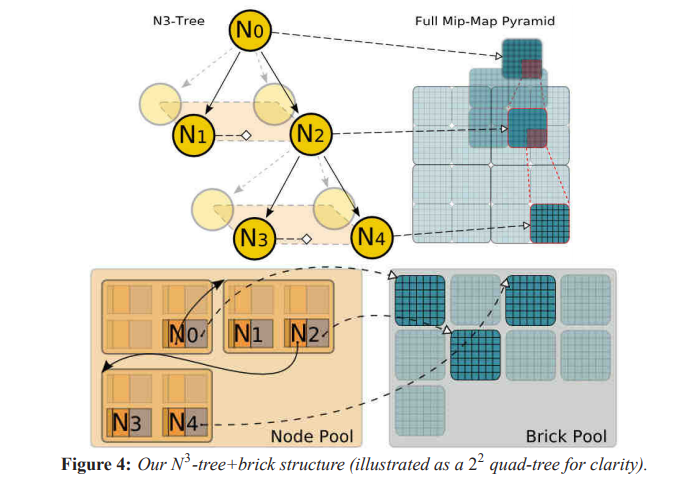
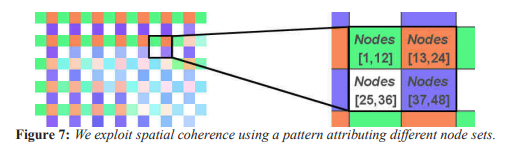
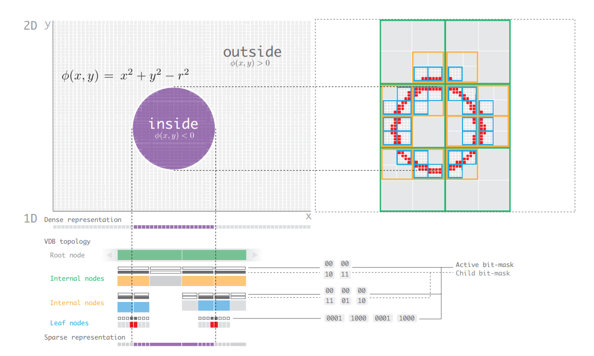

# 体素渲染

最近自己在自娱自乐的写一个体素[存储引擎](https://github.com/yslib/VoxelMan.git)， 在这里记录一下需要用到的相关资料。

自己写的这个体素存储引擎主要面向大规模(100TB)科学计算可视化数据的（以Raycasting 渲染为主），这种应用的特点是数据是**稠密**的，并且**不能引入太多预处理过程**，因为数据量太大，预处理的开销也是不可接受的。而且这种应用一般都需要实时改变传输函数，相当于整个空间都有数据。当然也不绝对，因为即使对于大部分科学计算数据来讲，至少表现上是稀疏的，我们感兴趣的部分基本上不太可能充满整个空间，总有一个主体。但是为了不失一般性，加入了可实时改变传输函数这个约束，整个数据就谈不上稀疏性了，或者说稀疏性变得不是那么直白。但是可以借助平衡树来作为mask管理可见块。(Hierachical DDA)。

### Volume Rendering & Ray-Casting(Ray-marching)


虽然这里主要介绍体素的存储，并且体素的表现方式并不局限于Raycasting，但是对于体素来说，Raycasting终归是一个绕不开的话题。在这里简单的介绍一下Raycasting.


对从当前像素发出的射线上每个点进行颜色累加作为这个像素最终的颜色，

- 从前先后：

$$
C_{dst} = C_{dst} + (1 - \Alpha_{dst}) C_{src}
$$

$$
\alpha_{dst} = \alpha_{dst} + (1 - \Alpha_{dst}) C_{src}
$$

- 从后向前：

至于这个公式是怎么来的，可以参考[Real-Time Volume Graphics](http://www.real-time-volume-graphics.org/)这本书。总的来说，上面的两个形式就是在只考虑吸收和发散模型的光线在介质中的传播方程，经过离散化（积分->黎曼和）后的[数值解法](https://www.cg.informatik.uni-siegen.de/data/Tutorials/EG2006/RTVG01_Theory.pdf)。


### 关于体素存储的文章：
#### storage
- [Efficient Sparse Voxel Octrees(SVO)](): [ShaderToy Implementation](https://www.shadertoy.com/view/3d2XRd)
- High Resolution Sparse Voxel DAGs
- GigaVoxels: [GigaVoxels: Ray-Guided Streaming for Efficient and Detailed Voxel Rendering](https://maverick.inria.fr/Publications/2009/CNLE09/CNLE09.pdf)
- OpenVDB: [VDB: High-Resolution Sparse Volumes with Dynamic Topology](http://www.museth.org/Ken/Publications_files/Museth_TOG13.pdf)


#### Application

- [Interactive Indirect Illumination Using Voxel Cone Tracing](https://research.nvidia.com/sites/default/files/pubs/2011-09_Interactive-Indirect-Illumination/GIVoxels-pg2011-authors.pdf)


- **Vitual Texture**

#### Others
- [Optimizing Memory Access on GPUs using Morton Order Indexing](https://john.cs.olemiss.edu/~rhodes/papers/Nocentino10.pdf)
- [Soring Spatial Data](https://www.cs.umd.edu/~hjs/pubs/geoencycl.pdf)

### 和体素有关的项目或工具:

- [MagicaVoxel](http://ephtracy.github.io/)

- [Goxel](https://github.com/guillaumechereau/goxel)

- [Volume of Fun](http://www.volumesoffun.com/)

    - [PolyVox](http://www.volumesoffun.com/polyvox-about/)

    - [Cubiquity 2](https://github.com/DavidWilliams81/cubiquity)


### SVO(GPU)

八叉树存储，重点是八叉树的遍历方式。这种类型的数据结构一般都是stackless遍历。
比如对于kd-tree的有栈遍历方法(无递归):

1. 判断射线和当前的节点的相交片段，如果只包含了分割平面的其中一侧（一定是里视点近的那一个），那就直接遍历这个节点。否则先把远处的那个节点压栈，然后遍历这个（离视点近的）节点。
这样栈顶部的节点距视点的距离比栈底部的节点更近。
2. 这样一直遍历去，如果当前节点是叶节点，执行普通求交规则，如果hit，则执行相应逻辑，否则判断栈是否为空。如果为空，整个遍历过程结束（即遍历完整个场景了），否则出栈继续执行上一步。

[KD-Tree Acceleration Structures for a GPU Raytracer](https://graphics.stanford.edu/papers/gpu_kdtree/kdtree.pdf)

去掉这个栈操作有两个方法

1. 去掉压栈操作，并且在原算法需要出栈的时候，直接从(root, tMax, global_tMax)的地方**重新遍历树**。也就是直接从根节点寻找下个节点（不用栈存储了）(kd-restart)
2. 去掉压栈操作，并且在原算法需要出栈的时候，直接回溯到第一个修改[tMin,tMax]的祖先的节点，然后继续遍历。（这种方法需要额外记录父节点信息）(kd-backtrace)

其实这些方法的核心思想都是基于DDA的，即对于一个射线区间段[tMin, tMax]来说，下一个区间段的tMin就是当前区间段的tMax。虽然标准的DDA是面向规则网格的(Grid)，但是对于这种层次化的树结构，虽然网格不是规则的，但上述事实并没有改变。（只要保证是空间的一个划分）

octree和kd-tree不同的地方在于，octree是局部规则的网格，在遍历子节点的时候可以直接通过坐标转换得到。

[Stackless KD-Tree Traversal for High Performance GPU Ray Tracing](http://www.johannes-guenther.net/StacklessGPURT/StacklessGPURT.pdf)

### GigaVoxels(GPU):

- N^3-Tree


- 树的组织形式不是通常的指针（因为要在纹理里面存储），而是层次化的3d-texture cache。分为两个3d texture。 其中一个存放node metadata。每个node metadata里面有N^3个关于
元素，按照对应的空间位置排列。可以看到，这本质上就是一个以direct accessed array方式存储的被层次化的hash table。指针被解释为block在texture 中的偏移。


- 表面是个树，其实是一个hash table。

至此，存储部分就结束了，其实存储部分没有多少内容。

接下来就是绘制, Ray-casting的时候是用的是类似于kd-restart去遍历octree。

Feedback过程是关键。这里使用的是多个RT存储缺页id。组织成一个2d texture array。 就像实现OIT一样，每个像素对应一个链表（数组），用来存放这个像素对应的射线在遍历的时候发现的没有在显存中的block id。但是直接这样做有两个问题：



1. 相邻像素发出的射线大概率会检测到相同的块，因此重复度很高。

2. 一个像素对应一个链表可能会使空间分配不均因。

基于以上两点考虑，可以让2x2四个像素公用四个链表的存储空间。


CPU直接处理这几个RT里面的信息显然吃不消（除了回读的代价外，还需要无差别遍历这几个rt中的每个像素去找到所有的不重复的缺页id），因此需要一个mask来指示一个不重复的缺页id集合。这个mask也是一张2d texture。每个像素可以解释为一个bit vector(32bit almost)。然后在CPU端通过这个像素信息去索引记录缺页id的rt。当然为这个mask texture 的每个像素构造bit vector除了要去重之外还涉及到了另外一篇文章的方法（金字塔直方图，就是一个统计问题，主要用来压缩），这里不细讲。


总结:
其实这篇文章写作上对读者不太友好。有些地方不够详细。比如feedback的过程和遍历树的过程。因为这两个地方并不是引用的其他文章，这里应该详细描述才对。而且feedback的过程图示非常让人迷惑。


实现了这篇文章的方法的开源项目有 (Voreen)

### OpenVDB(CPU)


- 一个矮胖的树
    - 树高固定
    - 每个节点分支数固定


- 子节点数量很多。在实现上把节点分为三类做特化**LeafNode**, **InternalNode**, **RootNode**, 用模板参数直接确定节点的结构。


- 对于根节点，用了一个map把最上面的一层InternalNode打散，具体是hash map还是balanced tree map，还是看应用。虽然从时间复杂度上看hash map要好，
但是hashing过程开销比较高，并且基于第一层InternalNode不是很多这个实时，直接用dense hash效果更好。虽然对于这种高度平衡的树来说，每次访问都是O(1)，但是毕竟
还是要遍历树的。因此止步于此的话，O(1)的Random access也只是流于形式。所以还需要用到Accessor作为缓存。这个东西的设计思想类似于硬件TLB.





代码当中预定义的一些树

```cpp

using BoolTree     = tree::Tree4<bool,        5, 4, 3>::Type;
using DoubleTree   = tree::Tree4<double,      5, 4, 3>::Type;
using FloatTree    = tree::Tree4<float,       5, 4, 3>::Type;
using Int32Tree    = tree::Tree4<int32_t,     5, 4, 3>::Type;
using Int64Tree    = tree::Tree4<int64_t,     5, 4, 3>::Type;
using MaskTree     = tree::Tree4<ValueMask,   5, 4, 3>::Type;
using StringTree   = tree::Tree4<std::string, 5, 4, 3>::Type;
using UInt32Tree   = tree::Tree4<uint32_t,    5, 4, 3>::Type;
using Vec2DTree    = tree::Tree4<Vec2d,       5, 4, 3>::Type;
using Vec2ITree    = tree::Tree4<Vec2i,       5, 4, 3>::Type;
using Vec2STree    = tree::Tree4<Vec2s,       5, 4, 3>::Type;
using Vec3DTree    = tree::Tree4<Vec3d,       5, 4, 3>::Type;
using Vec3ITree    = tree::Tree4<Vec3i,       5, 4, 3>::Type;
using Vec3STree    = tree::Tree4<Vec3f,       5, 4, 3>::Type;
using ScalarTree   = FloatTree;
using TopologyTree = MaskTree;
using Vec3dTree    = Vec3DTree;
using Vec3fTree    = Vec3STree;
using VectorTree   = Vec3fTree;
```


```cpp

/// @brief Tree3<T, N1, N2>::Type is the type of a three-level tree
/// (Root, Internal, Leaf) with value type T and
/// internal and leaf node log dimensions N1 and N2, respectively.
/// @note This is NOT the standard tree configuration (Tree4 is).
template<typename T, Index N1=4, Index N2=3>
struct Tree3 {
    using Type = Tree<RootNode<InternalNode<LeafNode<T, N2>, N1>>>;
};


/// @brief Tree4<T, N1, N2, N3>::Type is the type of a four-level tree
/// (Root, Internal, Internal, Leaf) with value type T and
/// internal and leaf node log dimensions N1, N2 and N3, respectively.
/// @note This is the standard tree configuration.
template<typename T, Index N1=5, Index N2=4, Index N3=3>
struct Tree4 {
    using Type = Tree<RootNode<InternalNode<InternalNode<LeafNode<T, N3>, N2>, N1>>>;
};

/// @brief Tree5<T, N1, N2, N3, N4>::Type is the type of a five-level tree
/// (Root, Internal, Internal, Internal, Leaf) with value type T and
/// internal and leaf node log dimensions N1, N2, N3 and N4, respectively.
/// @note This is NOT the standard tree configuration (Tree4 is).
template<typename T, Index N1=6, Index N2=5, Index N3=4, Index N4=3>
struct Tree5 {
    using Type =
        Tree<RootNode<InternalNode<InternalNode<InternalNode<LeafNode<T, N4>, N3>, N2>, N1>>>;
};
```

### 虚拟纹理

- VT in software
    - Simple in theroy, but hard to implement efficiently.

软件虚拟纹理实现的难点在于，现在的管线似乎不是为频繁更新纹理设计的。因为VT不可避免的频繁（相对）更新纹理，所以这是一个drawback。
虚拟纹理的核心是feekback的过程。这个过程决定了渲染的效率。这个也得是全程软件实现，因此效率千差万别。
优化的办法除了动态的确定working set，还可以离线烘焙feekback data。如同PVS一样，不过这个还和具体应用有关。对于科学可视化来的体绘制来说说，这个几乎不能用，因为不能假定可见性。


现在使用的是ray-guided方式，完全由ray决定。排除实现本身的效率之外，并不清楚这种做法的效率有多高。

就拿PageTable(Address translation)的实现方式来说,hashtable 很直观，但是想要实现一个对GPU管线友好的数据结构还是很困难。
用Texture? 每次都要更新部分纹理。但是其地址转换过程是最快的（直接采样）。但是很浪费空间，基本上虚拟纹理有多大，这个pagetable就有多大（个数上成正比）。

每种方式的实现都千差万别。

- VT in hardware
    不用自己管理映射结构（页表），但是需要自己做缺页处理。一般是在shader里用一个纹理采样，如果采到了就返回纹理数据，采不到就返回一个0之类的。feedback的过程自己处理。


### 体素渲染
1. Ray casting

2. Ray tracing(contour set, cube)
[](https://medium.com/@calebleak/cube-voxel-rendering-bc5d87c24c3)

3. Cube Rendering: [](https://medium.com/@calebleak/quads-all-the-way-down-simple-voxel-rendering-fea1e4488e26)