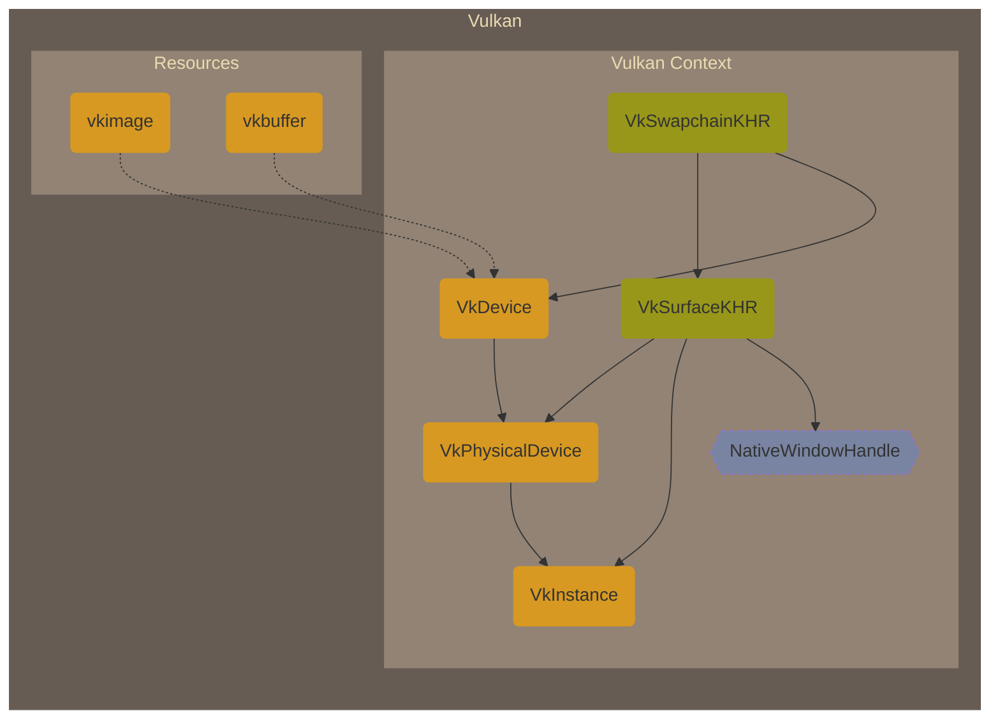
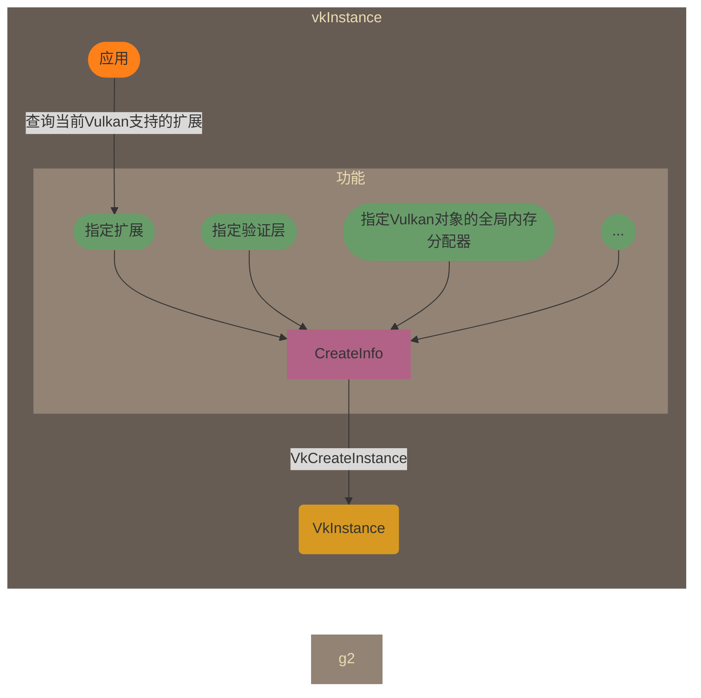
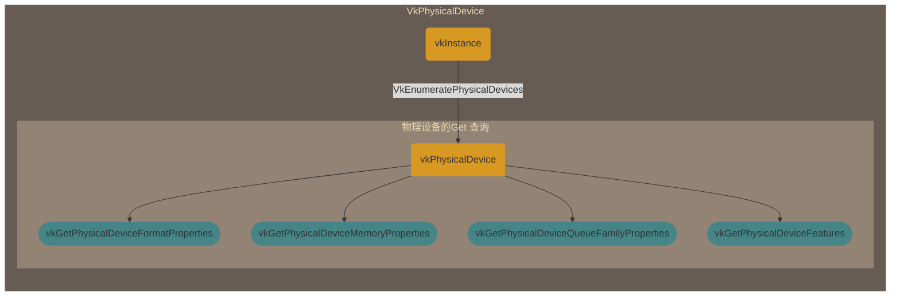
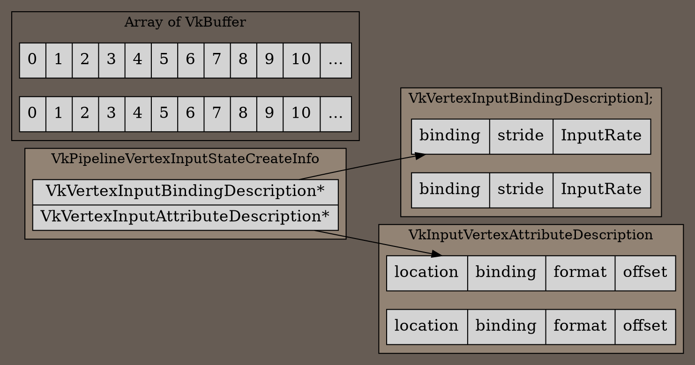

# Vulkan Overview

Explicitly,Statically,Seperately



**Explicit, Explicit, Explicit**

## 实例(vkinstance)
### 简介
vulkan实例隔离了不同的vulkan环境，在一个应用程序中，可以创建多个实例。但是实例之间的对象不能共享，如内存。（在不涉及扩展的情况下）




### 功能

1. 枚举当前环境支持的扩展:


2. 是否启用扩展：

  真正启用扩展的地方是在创建逻辑设备的时候，但是是否允许开启扩展的地方是在创建实例时。

3. 是否开启验证层：

  包括调试回调。调试回调也属于扩展。

4. 指定全局内存分配器：

  Vulkan提供了一个全局内存分配器回调，让用户可以接管Vulkan对象的所需要使用主机端的内存的分配。

## 物理设备(vkPhysicalDevice)
### 简介
在初始化Vulkan的物理设备时，除了选择需要的物理设别外，还应该获取关于物理设备的一些属性供之后使用



### 功能
1. 图像格式属性(vkGetPhysicalDeviceFormatProperties)：

  图像格式属性的描述结构体为：


  通常，为了完整性，在创建一个需要指定格式的Vulkan对象时，比如创建一个R8B8GBA8格式的纹理，或者格式为24位的深度缓冲，需要查询物理设备是不是支持这种格式。但是一个格式还有附加的属性，比如这个格式是不是支持

2. 设备内存：

  Vulkan的内存属性比较复杂，任何需要设备内存的对象的创建都需要指定内存类型。如Image和Buffer。内存类型有很多，并且每种类型都由某种类型的堆负责创建。
  当使用vkGetPhysicalDeviceMemoryProperty 查询相应物理设备支持的内存时，获取到的内存属性包括两个数组。第一个是支持的内存类型，
  第二个是支持的内存堆。支持的内存类型是由一系列bitflags决定的，并且支持的内存类型里还包括了一个索引，这个索引就是由相应支持分配的堆所在数组的索引。

  总的来说，Vulkan的设备内存属性用**堆类型**和**内存类型**两个维度来描述。从设计上来说，这两个维度是正交的。实际上考虑到实现，这两个维度并不是完全独立的。关于内存这一块，
  下面会有详细的介绍，这里只是简要的引出内存属性这个概念。
  分配设备内存的时候需要指定**内存类型**和**堆类型**

  ```mermaid
  graph LR
  subgraph g0[VkPhysicalDeviceMemoryProperties]
  i-->a([memoryType])
  i-->b([memoryHeap])
  end
  style g1 fill:#928374,stroke-width:0px,color:#ebdbb2;
  style g0 fill:#665c54,stroke-width:0px,color:#ebdbb2;
  end

  ```

    - 内存类型
       
      内存类型标志位大概有这几种类型：（其余见官方规范手册）

      1. DEVICE_LOCAL_BIT： 设备专用内存，一般是纹理或者顶点缓冲使用的内存

      2. HOST_VISIBLE_BIT： 主机可见内存，表明内从可以被主机端映射，可以在主机端像访问CPU内存一样直接存取

      3. COHERENT_BIT：对于主机可见内存的访问保持一致性，否则需要手动更新内存。

      4. HOST_CACHED_BIT：这种内存会缓存在cpu端，但是主机端的访问可能会慢一些。

      5. LAZILY_ALLOCATED_BIT：延迟分配。

      这几种并不是随意组合的，合法的组合请参照Vulkan规范手册

    - 堆类型

      堆类型标志位大概由这几种类型：（其余见官方规范手册）

      1. DEVICE_LOCAL_BIT: 设备中的堆，一般位于是运行Vulkan的硬件设备，比如GPU。这种就是大多数情况。

      2. MULTI_INSTANCE_BIT: 当一个逻辑设备是由多个物理设备构成时，分配内存的时候会重复分配到每个物理设备中。（用在分布式上？）

3. 支持的队列族：

  同样也用索引来标识，创建逻辑设备时需要指定。队列也是不同于之前传统API的新特性。

4. 物理设备属性(VkPhysicalDeviceProperties via vkGetPhysicalDeviceProperties)

  物理设备属性字段中有一个设备限制（VkPhysicalDeviceLimits）字段，这个字段给出了当前物理设备支持的各种属性的极限或者说是最大值。
  其中比较基础的有以下几项：
    
    - 最大采样数

    - 

5. 物理设备特性(VkPhysicalDeviceFeatures via vkGetPhysicalDeviceFeatures)

  注意物理属性做区分，这个字段当中都是Bool变量，描述了此物理设备是否支持某一个特性。在之后创建逻辑设备中，要指定一些特性，这些特性必须是物理设备支持的。


## 逻辑设备(vkDevice)
### 简介

  逻辑设备是Vulkan对物理设备的抽象。可以从一个物理设备上创建多个逻辑设备。逻辑设备对象负责vulkan的设备资源分配。
  负责的主要功能有：

### 功能

  1. 开启扩展：

     如果需要窗口显示功能，这里需要开启交换链扩展

  2. 指定设备要用到的队列：

     如果需要绘制流水线功能就指定图形队列，如果要使用计算着色器的功能，就指定计算队列。

## 表面（vkSurfaceKHR, 扩展）

### 简介

  表面是展示渲染结果的那个对象，可以不严谨地理解为呈现绘制结果的那个窗口区域。表面不是Vulkan核心的一部分。因为显示窗口不具备跨平台性，所以vulkan没有义务去做这个限制。
  （其实OpenGL也没有）。首先查询物理设备的队列族是不是支持表面。输入参数为物理设备和所使用的队列族索引。
  创建表面需要从实例创建，创建表面除了需要实例，还需要一个显示表面的窗口句柄，这个窗口句柄取决于平台。

### 功能


## 平面(Plane,扩展)
### 简介

## 交换链(vkSwapchainKHR, 扩展)

### 简介

交换链提供和管理表面中的数据，一般情况下是一个环形的缓冲，一些表面用来显示在窗口上，一些表面用来接受绘制的结果供接下来的展示用。
不严谨地说就是帧缓冲的管理器。为什么不严谨，因为表面的数据不是Vulkan所管理的，而是操作系统。
创建交换链需要指定之前创建的表面以及逻辑设备。因此交换链是被逻辑设备所拥有的。
创建交换链需要一下信息：

## 缓冲(VkBuffer)
### 简介

  与OpenGL中glCreateBuffer创建出来的对象等价。需要指名Buffer 的用法。与OpenGL不同的是，这里创建好的buffer没有内存，需要绑定到另外的内存对象上。

## 图像(VkImage)

### 简介
  在Vulkan 里创建图像的一般方式也是先把图像数据放入暂存缓冲，然后从暂存缓冲复制到GPU中。然而与OpenGL不同的是这里的图像需要指定
  图像布局(ImageLayout)。图像布局描述了当前图像所扮演的角色。图像的布局大概分为一下几种：

  1. PRESENT (VK_IMAGE_LAYOUT_PRESENT_SRC_KHR): 用来作为呈现图像，这个布局可以绘制到屏幕上。

## 资源绑定

### 简介

  着色器的模型就是典型的SIMD模型，只不过每个线程是面向几何顶点或者屏幕上的片元调度的。一个SIMD模型的代码结构如下：

  ```

  global shared_var1,shared_var2

  thread(var1, var2)
  {
    // do something with var1, var2

    // do something with shared_var1 shared_var2
  }
  ```

  可以看到，当一个线程被调度时,有属于当前线程自己的资源以所有线程都能访问的共享资源。同样，在着色器中，也有这两种资源。
  局部变量对应逐顶点属性(Attribute)，共享资源对应统一变量(Uniform)。至于属性(Attribute) 和统一变量(Uniform)只是glsl中的修饰符。不同API名字虽然不同，
  但对应的都是这两个概念。

  
  |Vulkan(OpenGL)|D3D12|说明|
  |------|-----|----|
  |UBO(Uniform Buffer Object)|Constant Buffer|全局统一变量|
  |Texel Buffer |typed buffer | 纹素缓冲|
  |SSBO|UAV buffer(Unordered Access View)|通用缓冲 |
  |Image|UAV texture | 可写的图像类型|

  在Vulkan 的API中，着色器局部变量也就是Attribute，用属性(Attribute)来描述。着色器共享变量(Uniform)信息用描述符(Descriptor)来描述。区分这两个概念有助于理清繁琐的Vulkan API。

  ```dot
  digraph g{
    "node0"[shape="record" label="Attribute"];
  }
  ```

### 功能

  描述符集布局（以下简称描述符布局）是描述都有哪些Uniform变量的对象，创建描述符布局需要一个CreateInfo（VkDescriptorSetLayoutCreateInfo）,其中一个数组字段包含了每个Uniform变量的信息（VkDescriptorSetLayoutBinding）。

  注意，描述符集和描述符布局的区别是，描述符**布局**并没有和具体的数据关联，而**集**却关联了数据。例如，布局只是说这个集有一个uniform buffer 和 一个 uniform sampler。
  而在这个布局的基础上通过池分配出来的集需要关联哪一个uniform buffer和uniform sampler数据。

  + 描述符集布局绑定（单个变量的信息对象）
  + 描述符集布局（单个变量信息对象的集和）
  + 描述符池: 创建这个池需要指定将要从这个池中分配多少个描述符以及多少个描述符集。分配方式为描述符个数以最大描述符集个数的一个划分。
  + 描述符集（根据布局通过池分配出来的带有真正数据的对象）
    描述符集属于管线资源，在绘制指令的时候进行绑定。绑定的这个描述符集要和

  如果直接从API翻译，这几个概念对应的中文很拗口。他们几个之间的关系如下图

  ```dot
  digraph g{
    splines=true
    rankdir="LR"
    bgcolor="#665c54"
    node[style="filled" color="#ebdbb2"]
    "layout0"[shape="record" label="VkDescirptorSetLayout"];
    "layout1"[shape="record" label="VkDescirptorSetLayout"];
    "binding0"[shape="record" label="VkDescirptorBinding(Buffer) | VkDescriptorBinding(Texture) | ..."];
    "binding1"[shape="record" label="VkDescirptorBinding(Buffer) | VkDescriptorBinding(Sampler) | ..."];
    "playout0"[shape="record" label="VkPipelineSetLayout"]
    subgraph cluster2{
      label="VkDescriptorPool"
      "set0"[shape="record" label="VkDescriptorSet"]
      "set1"[shape="record" label="VkDescriptorSet"]
    }
    playout0->layout0
    playout0->layout1
    layout0->binding0
    layout1->binding1
    layout0->set0
    layout1->set1
  }
  ```

  顶点属性的buffer 也是要通过绘制指令绑定到管线。顶点属性一般指定：
  + 对应的顶点缓冲数组的索引（Buffer Index）
  + 指定着色其中的绑定点（Binding）
  + 步长（Stride）
  + 偏移 (Offset)
  + 格式（Format） （在OpenGL中，这一步通过分量格式和分量个数表示）
  

在vulkan中，上面5个属性的指定被分配在了两个结构体中。分别是```VkVertexInputBindingDescription``` 和 ```VkVertexInputAttributeDescription```其中前者指定了绑定索引(binding),这个也就是在后续进行绘制指令提交时指定的缓冲区数组的索引。以及步长(stride),即每一个被解释的元素的大小。后者指定了绑定的着色器中的变量（location）。这两个描述结构体是的参数正交地描述了顶点属性的配置。



  + 下图为Vulkan和OpenGL 中进行逐顶点属性绑定API的对比表格

|Vulkan|OpenGL(DSA version)|OpenGL(non-DSA)|
|------|------|------|
|VkVertexInputBindingDescription|glVertexArrayVertexBuffer|glVertexAttribPointer|
|VkVertexInputAttributeDescription|glVertexAttribFormat|


  ```
  (示意图)
  ```


