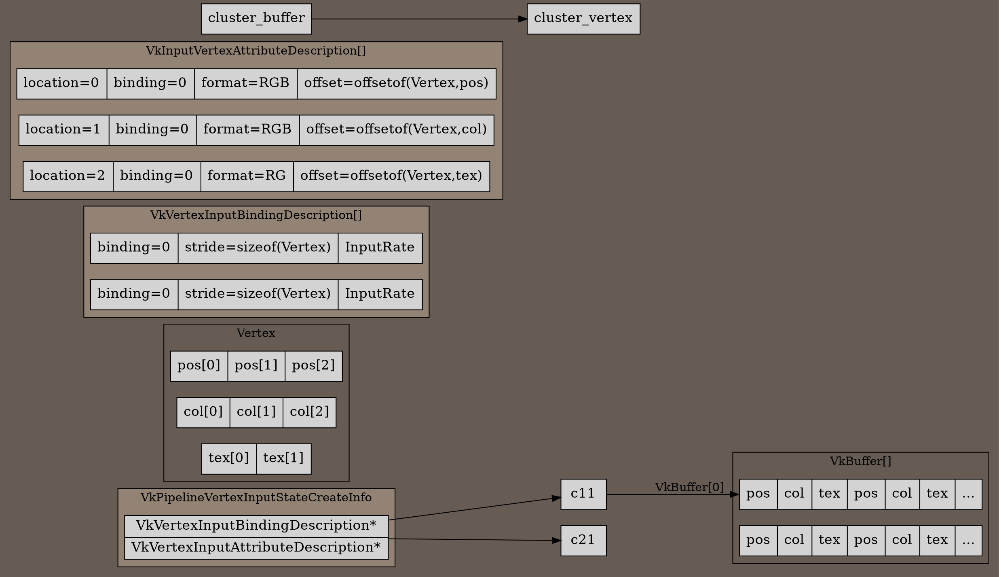

# Vulkan Overview

Explicitly,Statically,Seperately


**Explicit, Explicit, Explicit**

## 实例(vkinstance)
### 简介
vulkan实例隔离了不同的vulkan环境，在一个应用程序中，可以创建多个实例。但是实例之间的对象不能共享，如内存。（在不涉及扩展的情况下）


### 功能

1. 枚举当前环境支持的扩展:


2. 是否启用扩展：

  真正启用扩展的地方是在创建逻辑设备的时候，但是是否允许开启扩展的地方是在创建实例时。

3. 是否开启验证层：

  包括调试回调。调试回调也属于扩展。

4. 指定全局内存分配器：

  Vulkan提供了一个全局内存分配器回调，让用户可以接管Vulkan对象的所需要使用主机端的内存的分配。

## 物理设备(vkPhysicalDevice)
### 简介
在初始化Vulkan的物理设备时，除了选择需要的物理设别外，还应该获取关于物理设备的一些属性供之后使用


### 功能
1. 图像格式属性(vkGetPhysicalDeviceFormatProperties)：

  图像格式属性的描述结构体为：

  通常，为了完整性，在创建一个需要指定格式的Vulkan对象时，比如创建一个R8B8GBA8格式的纹理，或者格式为24位的深度缓冲，需要查询物理设备是不是支持这种格式。但是一个格式还有附加的属性，比如这个格式是不是支持

2. 设备内存：


3. 支持的队列族：

  同样也用索引来标识，创建逻辑设备时需要指定。队列也是不同于之前传统API的新特性。

4. 物理设备属性(VkPhysicalDeviceProperties via vkGetPhysicalDeviceProperties)

  物理设备属性字段中有一个设备限制（VkPhysicalDeviceLimits）字段，这个字段给出了当前物理设备支持的各种属性的极限或者说是最大值。
  其中比较基础的有以下几项：
    
    - 最大采样数

    - 

5. 物理设备特性(VkPhysicalDeviceFeatures via vkGetPhysicalDeviceFeatures)

  注意物理属性做区分，这个字段当中都是Bool变量，描述了此物理设备是否支持某一个特性。在之后创建逻辑设备中，要指定一些特性，这些特性必须是物理设备支持的。


## 逻辑设备(vkDevice)
### 简介

  逻辑设备是Vulkan对物理设备的抽象。可以从一个物理设备上创建多个逻辑设备。逻辑设备对象负责vulkan的设备资源分配。
  负责的主要功能有：

### 功能

  1. 开启扩展：

     如果需要窗口显示功能，这里需要开启交换链扩展

  2. 指定设备要用到的队列：

     如果需要绘制流水线功能就指定图形队列，如果要使用计算着色器的功能，就指定计算队列。

## 表面（vkSurfaceKHR, 扩展）

### 简介

  表面是展示渲染结果的那个窗口对象，可以不严谨地理解为呈现绘制结果的区域。表面不是Vulkan核心的一部分。因为显示窗口不具备跨平台特性。

### 功能

  表面并且和表面相关的API带有**KHR**后缀。

  - 表面的创建需要依赖与实例(VkInstance)。
  - 表面是否被支持取决于于物理设备(VkPhysicalDevice)(vkGetPhysicalDeviceSurfaceSupportKHR)。可见物理设备章节的说明图中红色的部分。
  - 表面的创建需要依赖于一个平台相关的窗口句柄。

  以Windows上的平台为例，下面是创建表面所需要的信息

```c++
// Provided by VK_KHR_win32_surface
typedef struct VkWin32SurfaceCreateInfoKHR {
  VkStructureType sType;
  const void* pNext;
  VkWin32SurfaceCreateFlagsKHR flags;
  HINSTANCE hinstance;
  HWND hwnd;            // win32 native window handle
} VkWin32SurfaceCreateInfoKHR;

```
创建函数,需要用到Vulkan实例

```c++
// Provided by VK_KHR_win32_surface
VkResult vkCreateWin32SurfaceKHR(
  VkInstance instance,                 // vulkan instance is needed
  const VkWin32SurfaceCreateInfoKHR* pCreateInfo,
  const VkAllocationCallbacks* pAllocator,
  VkSurfaceKHR* pSurface);

```

从接口来看，判断设备是否支持交换链之后，在窗口系统下，我们就可以直接窗前表面（VkObject）对象了。


## 平面(Plane,扩展)
### 简介
  
  与平面平行的概念是窗口句柄。根据Vulkan规范，这个扩展由VK_KHR_display提供。这个对象用来代替之前创建表面(VkSurface)用的平台相关的窗口句柄来创建一个表面。也就是说，这个扩展可以实现在没有窗口系统上直接把结果绘制到显示器上的功能。（目前为止，没见过使用这个扩展的任何Demo，我自己也没考察过）
  
  可以通过与之前创建表面的信息结构体做对比会发现，通过这种方法创建表面不许要窗口句柄。而是一个Plane，这个Plane对象直接从物理设备获得支持。

  ```c++
typedef struct VkDisplaySurfaceCreateInfoKHR {
  VkStructureType sType;
  const void* pNext;
  VkDisplaySurfaceCreateFlagsKHR flags;
  VkDisplayModeKHR displayMode;
  uint32_t planeIndex;
  uint32_t planeStackIndex;
  VkSurfaceTransformFlagBitsKHR transform;
  float globalAlpha;
  VkDisplayPlaneAlphaFlagBitsKHR alphaMode;
  VkExtent2D imageExtent;
} VkDisplaySurfaceCreateInfoKHR;
// no need for native window handle
  ```

  ```c++
// Provided by VK_KHR_display
VkResult vkCreateDisplayPlaneSurfaceKHR(
  VkInstance instance,
  const VkDisplaySurfaceCreateInfoKHR* pCreateInfo,
  const VkAllocationCallbacks* pAllocator,
  VkSurfaceKHR* pSurface);
  ```

## 交换链(vkSwapchainKHR, 扩展)

### 简介

交换链提供和管理表面中的绘制结果数据，一般情况下是一个环形的缓冲，一些表面用来显示在窗口上，一些表面用来接受绘制的结果供接下来的展示用。相当于帧缓冲的管理器，把绘制完成的数据呈现到表面上。
创建交换链需要指定之前创建的表面以及逻辑设备。因此交换链是被逻辑设备所拥有的。
交换链由**VK_KHR_swapchain**扩展提供，因此如果需要交换链，创建逻辑设备时需要启用这个扩展。

创建交换链时，至少有三个属性是有必要检查的。(或者说是必要的)

  - 交换链的图像个数（缓冲个数），图像大小(```vkGetPhysicalDeviceSurfaceCapabilitiesKHR```)
  - 支持的表面格式(```vkGetPhysicalDeviceSurfaceFormatsKHR```)
  - 呈现模式(立即刷新，三缓冲等)(```vkGetPhysicalDeviceSurfacePresentModesKHR```)

```c++
// Provided by VK_KHR_swapchain
typedef struct VkSwapchainCreateInfoKHR {
  VkStructureType sType;
  const void* pNext;
  VkSwapchainCreateFlagsKHR flags;
  VkSurfaceKHR surface;               // create before
  uint32_t minImageCount;             // check
  VkFormat imageFormat;               // check
  VkColorSpaceKHR imageColorSpace;    // check
  VkExtent2D imageExtent;             // check
  uint32_t imageArrayLayers;
  VkImageUsageFlags imageUsage;
  VkSharingMode imageSharingMode;
  uint32_t queueFamilyIndexCount;
  const uint32_t* pQueueFamilyIndices;
  VkSurfaceTransformFlagBitsKHR preTransform;
  VkCompositeAlphaFlagBitsKHR compositeAlpha;
  VkPresentModeKHR presentMode;         // check
  VkBool32 clipped;
  VkSwapchainKHR oldSwapchain;
} VkSwapchainCreateInfoKHR;
```

```c++
VkResult vkCreateSwapchainKHR(
  VkDevice device,
  const VkSwapchainCreateInfoKHR* pCreateInfo,
  const VkAllocationCallbacks* pAllocator,
  VkSwapchainKHR* pSwapchain);
```


## 着色器模块
### 简介
着色器相对来说是一个独立的模块。这个模块作为渲染管线状态的一部分，是创建管线必须的参数。

## 资源：缓冲(VkBuffer) 和 图像(VkImage)
### 简介
  需要指名Buffer 的用法。与OpenGL不同的是，这里创建好的buffer没有内存，需要绑定到另外的内存对象上。
  Buffer通常用来存储线性的机构化或非结构化的数据。
  相比于OpenGL，Vulkan中的Buffer设计的更为一般化和清晰，OpenGL由于沉重的历史包袱，各种版本的Buffer的API非常混乱。
  从缓冲对象和图像对象我们可以观察到，Vulkan的概念反而更容易理解。下面的表格是关于缓冲对象的基本功能对应的API在Vulkan 和不同OpenGL版本之间的对比。

  |功能|Vulkan|OpenGL(DSA)|OpenGL(non-DSA)|OpenGL(legacy)|
  |------|------|----|----|----|
  |创建缓冲对象|vkCreateBuffer|glCreateBuffers|glGenBuffers+glBindBuffer|----|
  |分配缓冲存储空间|vkBindBufferMemory|glNamedBufferStorage|glBufferData|---|
  |暂存缓冲(host visible)数据传输|memcpy+vkMapMemory|glMapNamedBufferRange|glMapBufferRange|---|
  |设备缓冲(device local)数据传输|暂存缓冲+vkCmdCopyBuffer(*) | glNamedBufferData|glBufferData|---|
  |创建图像对象|vkCreateImage|glCreateTextures|glGenTextures+glBindTexture|glGenTextures+glBindTexture|
  |分配图像存储空间|vkBindBufferMemory|glTextureStorage{x}D|glTexStorage{x}D|glTexImage{x}D|
  |设备本地图像数据传输1|暂存缓冲+vkCmdCopyImage(*)|glTextureSubImage{x}D|glTexSubImage{x}D|glTexImage{x}D|
  |设备本地图像数据传输2|暂存缓冲+vkCmdCopyImage(*)|glMapNamedBufferRange+glReadPixel(PBO)|glMapBufferRange+glReadPixel|---|

  这个表格基本上展示了Vulkan 的缓冲和图像的基本功能的API。但是图像的使用在Vulkan中更加复杂，因为Vulkan的特点之一，显式同步会在图像这里得到体现。具体来说就是图像的布局之间的转换需要自己编写代码进行转换。

  资源这一部分属于各个Graphics API的核心内容，由于Vulkan的特性，这一部分更加复杂。在这里不做过多的说明。

  - [Modern OpenGL Functions](https://github.com/fendevel/Guide-to-Modern-OpenGL-Functions)


## 资源视图：缓冲视图（VkBufferView）和 图像视图（VkImageView）
### 简介

资源视图是对资源的重新解释，并且赋予了这个资源更加具体的属性。尤其是对于图像来说，图像资源本身的信息并不多，如果要使用图像资源，还应该赋予更加具体的解释，这样才能实现资源的复用。

## 内存(VkMemory)
### 简介
Vulkan的内存是Vulkan的重点特性之一。Vulkan中的资源对象与对应的内存是分离的。资源在使用之前，需要根据用途来绑定到不同的类型的内存对象。

Vulkan的内存属性比较复杂，任何需要设备内存的对象的创建都需要指定内存类型。如Image和Buffer。内存类型有很多，并且每种类型都由某种类型的堆负责创建。
当使用```vkGetPhysicalDeviceMemoryProperty``` 查询相应物理设备支持的内存时，获取到的内存属性包括两个数组。第一个是支持的内存类型，
第二个是支持的内存堆。支持的内存类型是由一系列bitflags决定的，并且支持的内存类型里还包括了一个索引，这个索引就是由相应支持分配的堆所在数组的索引。

总体来说，Vulkan的设备内存属性用**堆类型**和**内存类型**两个维度来描述。从设计上来说，这两个维度是正交的。实际上考虑到实现，这两个维度并不是完全独立的。关于内存这一块，
下面会有详细的介绍，这里只是简要的引出内存属性这个概念。
分配设备内存的时候需要指定**内存类型**和**堆类型**

  - 内存类型
      
    内存类型标志位大概有这几种类型：（其余见官方规范手册）

    1. **DEVICE_LOCAL_BIT**： 设备专用内存，一般是纹理或者顶点缓冲使用的内存

    2. **HOST_VISIBLE_BIT**： 主机可见内存，表明内从可以被主机端映射，可以在主机端像访问CPU内存一样直接存取

    3. **COHERENT_BIT**：对于主机可见内存的访问保持一致性，否则需要手动更新内存。

    4. **HOST_CACHED_BIT**：这种内存会缓存在cpu端，但是主机端的访问可能会慢一些。

    5. **LAZILY_ALLOCATED_BIT**：延迟分配。

    这几种并不是随意组合的，合法的组合请参照Vulkan规范手册

  - 堆类型

    堆类型标志位大概由这几种类型：（其余见官方规范手册）

    1. **DEVICE_LOCAL_BIT**: 设备中的堆，一般位于是运行Vulkan的硬件设备，比如GPU。这种就是大多数情况。

    2. **MULTI_INSTANCE_BIT**: 当一个逻辑设备是由多个物理设备构成时，分配内存的时候会重复分配到每个物理设备中。（用在分布式上？）


Vulkan本身的内存分配次数有限制，鼓励分配大块内存作为内存池，然后在这个基础上进行二次分配。然后把资源绑定在分配的内存区间段上。所以，如果编写一个基于Vulkan的通用RHI，需要自己实现一个高效的内存分配器。

## 资源绑定
### 简介

  着色器的模型就是典型的SIMD模型，只不过每个线程是面向几何顶点或者屏幕上的片元调度的。一个SIMD模型的代码结构如下：

  ```

  global shared_var1,shared_var2

  thread(var1, var2)
  {
    // do something with var1, var2

    // do something with shared_var1 shared_var2
  }
  ```

  可以看到，当一个线程被调度时,有属于当前线程自己的资源以所有线程都能访问的共享资源。同样，在着色器中，也有这两种资源。
  局部变量对应逐顶点属性(Attribute)，共享资源对应统一变量(Uniform)。至于属性(Attribute) 和统一变量(Uniform)只是glsl中的修饰符。不同API名字虽然不同，
  但对应的都是这两个概念。

  
  |Vulkan(OpenGL)|D3D12|说明|
  |------|-----|----|
  |UBO(Uniform Buffer Object)|Constant Buffer|全局统一变量|
  |Texel Buffer |typed buffer | 纹素缓冲|
  |SSBO|UAV buffer(Unordered Access View)|通用缓冲 |
  |Image|UAV texture | 可写的图像类型|

  在Vulkan 的API中，着色器局部变量也就是Attribute，用属性(Attribute)来描述。着色器共享变量(Uniform)信息用描述符(Descriptor)来描述。区分这两个概念有助于理清繁琐的Vulkan API。

  ```dot
  digraph g{
    "node0"[shape="record" label="Attribute"];
  }
  ```

### 功能

  描述符集布局（以下简称描述符布局）是描述都有哪些Uniform变量的对象，创建描述符布局需要一个CreateInfo（VkDescriptorSetLayoutCreateInfo）,其中一个数组字段包含了每个Uniform变量的信息（VkDescriptorSetLayoutBinding）。

  注意，描述符集和描述符布局的区别是，描述符**布局**并没有和具体的数据关联，而**集**却关联了数据。例如，布局只是说这个集有一个uniform buffer 和 一个 uniform sampler。
  而在这个布局的基础上通过池分配出来的集需要关联哪一个uniform buffer和uniform sampler数据。

  + 描述符集布局绑定（单个变量的信息对象）
  + 描述符集布局（单个变量信息对象的集和）
  + 描述符池: 创建这个池需要指定将要从这个池中分配多少个描述符以及多少个描述符集。分配方式为描述符个数以最大描述符集个数的一个划分。
  + 描述符集（根据布局通过池分配出来的带有真正数据的对象）
    描述符集属于管线资源，在绘制指令的时候进行绑定。绑定的这个描述符集要和

  如果直接从API翻译，这几个概念对应的中文很拗口。他们几个之间的关系如下图


  ```dot
  digraph g{
    splines=true
    rankdir="LR"
    bgcolor="#665c54"
    node[style="filled" color="#ebdbb2"]
    "layout0"[shape="record" label="VkDescirptorSetLayout"];
    "layout1"[shape="record" label="VkDescirptorSetLayout"];
    "binding0"[shape="record" label="VkDescirptorBinding(Buffer) | VkDescriptorBinding(Texture) | ..."];
    "binding1"[shape="record" label="VkDescirptorBinding(Buffer) | VkDescriptorBinding(Sampler) | ..."];
    "playout0"[shape="record" label="VkPipelineSetLayout"]
    subgraph cluster2{
      label="VkDescriptorPool"
      "set0"[shape="record" label="VkDescriptorSet"]
      "set1"[shape="record" label="VkDescriptorSet"]
    }
    playout0->layout0
    playout0->layout1
    layout0->binding0
    layout1->binding1
    layout0->set0
    layout1->set1
  }
  ```

  顶点属性的buffer 也是要通过绘制指令绑定到管线。顶点属性一般指定：
  + 对应的顶点缓冲数组的索引（Buffer Index）
  + 指定着色其中的绑定点（Binding）
  + 步长（Stride）
  + 偏移 (Offset)
  + 格式（Format） （在OpenGL中，这一步通过分量格式和分量个数表示）
  

在vulkan中，上面5个属性的指定被分配在了两个结构体中。分别是```VkVertexInputBindingDescription``` 和 ```VkVertexInputAttributeDescription```其中前者指定了绑定索引(binding),这个也就是在后续进行绘制指令提交时指定的缓冲区数组的索引。以及步长(stride),即每一个被解释的元素的大小。后者指定了绑定的着色器中的变量（location）。这两个描述结构体是的参数正交地描述了顶点属性的配置。



  + 下图为Vulkan和OpenGL 中进行逐顶点属性绑定API的对比表格

|Vulkan|OpenGL(DSA version)|OpenGL(non-DSA)|
|------|------|------|
|VkVertexInputBindingDescription|glVertexArrayVertexBuffer|glVertexAttribPointer|
|VkVertexInputAttributeDescription|glVertexAttribFormat|


## 资源同步
### 简介

